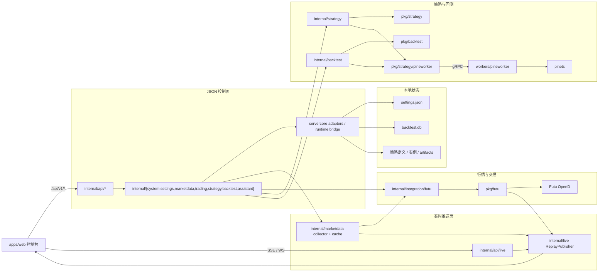
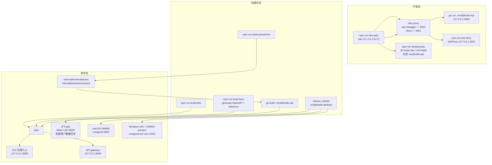

# JFTrade 架构 Mermaid 图

本文用 Mermaid 图补充 [architecture.md](./architecture.md) 的文字说明。它偏向“快速看边界”，不是替代接口、配置或协议专题文档。

## 系统总览

```mermaid
flowchart TB
    User["用户 / 浏览器 / 桌面窗口"]

    subgraph Frontend["前端与文档"]
        Web["apps/web<br/>Vue 3 + Vite 控制台"]
        Docs["docs<br/>VitePress 文档站"]
        RuntimeConfig["runtime-config.js<br/>运行时 API 地址"]
    end

    subgraph Entrypoint["进程入口与装配"]
        CLI["cmd/jftrade-api<br/>独立 API 入口"]
        Desktop["cmd/jftrade-desktop<br/>Wails v3 / profile / 单实例"]
        App["internal/app/apiserver<br/>启动 / 生命周期 / 运行时目录"]
        Core["servercore<br/>依赖装配 / 路由挂载 / runtime bridge"]
    end

    subgraph Transport["HTTP / SSE / WebSocket 层"]
        Middleware["internal/api/middleware<br/>认证 / CORS / 安全"]
        HTTP["internal/api/*<br/>/api/v1 JSON routes"]
        LiveAPI["internal/api/live<br/>SSE / WS live stream"]
        Swagger["docs/swagger<br/>OpenAPI / Swagger UI"]
    end

    subgraph Services["业务服务层"]
        SystemSvc["internal/system<br/>状态 / 诊断 / 观测摘要"]
        SettingsSvc["internal/settings<br/>配置读写 / 归一化"]
        MarketSvc["internal/marketdata<br/>订阅 / cache / collector / K线"]
        TradingSvc["internal/trading<br/>账户 / 订单 / 风控 / execution"]
        StrategySvc["internal/strategy<br/>策略定义 / 实例 / runtime 控制"]
        BacktestSvc["internal/backtest<br/>回测 / 历史同步 / 结果视图"]
        AssistantSvc["internal/assistant<br/>ADK session / run / approval / workflow"]
        CalendarSvc["internal/exchangecalendar<br/>交易日历管理"]
        DataSvc["internal/datamanagement<br/>数据维护 / 迁移入口"]
        LiveBus["internal/live<br/>ReplayPublisher / live events"]
    end

    subgraph Integration["集成与可复用能力"]
        FutuIntegration["internal/integration/futu<br/>OpenD 访问与 DTO 转换"]
        FutuPkg["pkg/futu<br/>Futu exchange adapter"]
        BrokerPkg["pkg/broker + pkg/market<br/>券商抽象 / 市场规则"]
        StrategyPkg["pkg/strategy<br/>Pine parser / IR / spec / lowering"]
        PineWorkerGo["pkg/strategy/pineworker<br/>Go gRPC client / worker manager"]
        PineWorkerNode["workers/pineworker<br/>Node ESM + PineTS executor"]
        BacktestPkg["pkg/backtest<br/>回测引擎与历史存储能力"]
        ADKPkg["pkg/adk<br/>ADK runtime"]
        BBGO["pkg/bbgo/*<br/>公共 types / stream / backtest primitives"]
    end

    subgraph RuntimeState["本地运行时文件"]
        DevVar["开发 / JFTrade Dev<br/>仓库 var/jftrade-api"]
        ProductData["正式桌面产品<br/>系统用户数据目录"]
        SettingsFile["settings.json"]
        BacktestDB["backtest.db"]
        Secrets["secrets/admin.key"]
        Artifacts["策略 / 回测 / worker artifacts<br/>日志 / desktop-state.json"]
    end

    subgraph External["外部依赖"]
        OpenD["Futu OpenD<br/>TCP 11110 / WebSocket 11111"]
        PineTS["pinets<br/>PineTS runtime"]
    end

    User --> Web
    User --> Desktop --> Web
    User --> Docs
    RuntimeConfig --> Web
    Desktop --> App

    Web -->|JSON HTTP /api/v1/*| Middleware
    Web -->|SSE /api/v1/stream/live| LiveAPI
    Web -->|WS /api/v1/ws/live| LiveAPI
    Web -->|/docs| Docs
    Web -->|/swagger| Swagger

    CLI --> App --> Core
    Core --> Middleware --> HTTP
    Core --> LiveAPI
    Core --> Swagger

    HTTP --> SystemSvc
    HTTP --> SettingsSvc
    HTTP --> MarketSvc
    HTTP --> TradingSvc
    HTTP --> StrategySvc
    HTTP --> BacktestSvc
    HTTP --> AssistantSvc
    HTTP --> CalendarSvc
    HTTP --> DataSvc
    LiveAPI --> LiveBus

    SystemSvc --> Core
    SettingsSvc --> Core
    TradingSvc --> Core
    StrategySvc --> Core
    BacktestSvc --> Core
    AssistantSvc --> Core
    DataSvc --> Core

    MarketSvc --> FutuIntegration
    TradingSvc --> FutuIntegration
    Core --> FutuIntegration
    FutuIntegration --> FutuPkg --> OpenD
    FutuPkg --> BrokerPkg
    FutuPkg --> BBGO

    StrategySvc --> StrategyPkg
    StrategySvc --> PineWorkerGo
    BacktestSvc --> BacktestPkg
    BacktestSvc --> PineWorkerGo
    PineWorkerGo -->|localhost gRPC| PineWorkerNode --> PineTS
    PineWorkerGo --> StrategyPkg
    BacktestPkg --> BBGO
    AssistantSvc --> ADKPkg

    MarketSvc --> LiveBus
    TradingSvc --> LiveBus
    Core --> LiveBus
    LiveBus --> LiveAPI

    Core --> DevVar
    Desktop --> ProductData
    SettingsSvc --> SettingsFile
    BacktestSvc --> BacktestDB
    Core --> Secrets
    StrategySvc --> Artifacts
    DevVar --> SettingsFile
    DevVar --> BacktestDB
    DevVar --> Secrets
    DevVar --> Artifacts
    ProductData --> SettingsFile
    ProductData --> BacktestDB
    ProductData --> Secrets
    ProductData --> Artifacts
```

## 主要运行链路

```mermaid
flowchart LR
    Web["apps/web 控制台"]

    subgraph JSON["JSON 控制面"]
        API["internal/api/*"]
        Services["internal/{system,settings,marketdata,trading,strategy,backtest,assistant}"]
        Core["servercore adapters / runtime bridge"]
    end

    subgraph Live["实时推送面"]
        LiveAPI["internal/api/live"]
        LiveBus["internal/live ReplayPublisher"]
        Collector["internal/marketdata collector + cache"]
    end

    subgraph MarketTrade["行情与交易"]
        FutuIntegration["internal/integration/futu"]
        FutuPkg["pkg/futu"]
        OpenD["Futu OpenD"]
    end

    subgraph StrategyBacktest["策略与回测"]
        StrategySvc["internal/strategy"]
        BacktestSvc["internal/backtest"]
        StrategyPkg["pkg/strategy"]
        BacktestPkg["pkg/backtest"]
        WorkerGo["pkg/strategy/pineworker"]
        WorkerNode["workers/pineworker"]
        PineTS["pinets"]
    end

    subgraph LocalStore["本地状态"]
        Settings["settings.json"]
        DB["backtest.db"]
        RuntimeFiles["策略定义 / 实例 / artifacts"]
    end

    Web -->|/api/v1/*| API --> Services --> Core
    Web -->|SSE / WS| LiveAPI --> LiveBus --> Web

    Services --> Collector --> FutuIntegration
    Services --> FutuIntegration --> FutuPkg --> OpenD
    Collector --> LiveBus
    FutuPkg --> LiveBus

    Services --> StrategySvc --> StrategyPkg
    Services --> BacktestSvc --> BacktestPkg
    StrategySvc --> WorkerGo
    BacktestSvc --> WorkerGo
    WorkerGo -->|gRPC| WorkerNode --> PineTS

    Core --> Settings
    Core --> DB
    Core --> RuntimeFiles
```

## 开发与发布链路

```mermaid
flowchart TB
    subgraph Dev["开发态"]
        DevAPI["go run ./cmd/jftrade-api<br/>127.0.0.1:3000"]
        DevWeb["npm run dev:web<br/>Vite 127.0.0.1:5173"]
        DevDocs["npm run dev:docs<br/>VitePress 127.0.0.1:3001"]
        Proxy["Vite proxy<br/>/api /swagger -> 3000<br/>/docs -> 3001"]
        DesktopDev["npm run desktop:dev<br/>JFTrade Dev / API 6698<br/>仓库 var/jftrade-api"]
    end

    subgraph Build["构建任务"]
        BuildWeb["npm run build:web"]
        BuildDocs["npm run build:docs<br/>generate OpenAPI + reference"]
        BuildWorker["npm run build:pineworker"]
        BuildAPI["go build ./cmd/jftrade-api"]
        BuildDesktop["release_assets<br/>cmd/jftrade-desktop"]
    end

    subgraph Release["发布态"]
        Dist["dist/"]
        GUI["GUI 同源入口<br/>127.0.0.1:6688"]
        Gateway["API gateway<br/>127.0.0.1:6699"]
        EmbeddedAssets["internal/frontendassets<br/>internal/pineworkerassets"]
        DesktopProduct["JFTrade<br/>Wails / API 6699<br/>系统用户数据目录"]
        MacDMG["macOS ARM64<br/>unsigned DMG"]
        WinNSIS["Windows x64 + ARM64 preview<br/>unsigned per-user NSIS"]
    end

    DevWeb --> Proxy --> DevAPI
    DevWeb --> Proxy --> DevDocs
    DevWeb --> DesktopDev

    BuildWeb --> Dist
    BuildDocs --> Dist
    BuildWorker --> EmbeddedAssets
    BuildAPI --> Dist
    BuildDesktop --> MacDMG
    BuildDesktop --> WinNSIS
    BuildDesktop --> DesktopProduct
    EmbeddedAssets --> BuildAPI

    Dist --> GUI
    Dist --> Gateway
```
