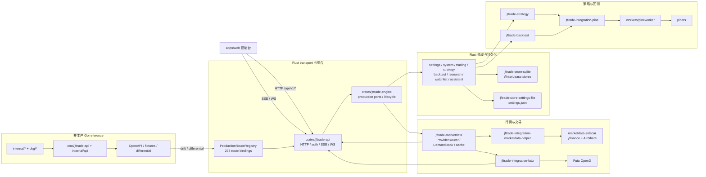
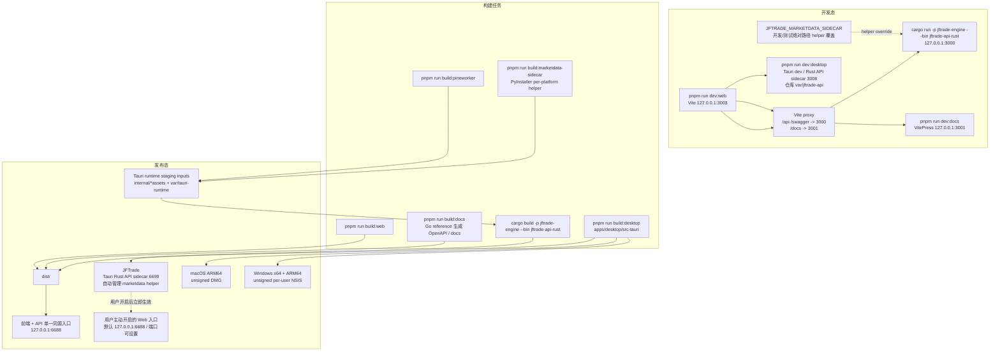

# JFTrade 架构 Mermaid 图

本文用 Mermaid 图补充 [architecture.md](./architecture.md) 的文字说明。它偏向“快速看边界”，不是替代接口、配置或协议专题文档。

行情 Provider 运行时包含 Futu OpenD、Yahoo Finance（yfinance）与 AKShare。新安装默认使用 AKShare；两个 Python Provider 共用随 `release_assets` 嵌入的 PyInstaller `marketdata-sidecar`，但运行时懒加载和健康状态相互隔离。Yahoo↔AKShare 切换复用同一进程，成功切回 Futu 后停止。`JFTRADE_MARKETDATA_SIDECAR` 仅用于开发/测试绝对路径覆盖，旧 yfinance 变量作为低优先级别名。两个 HTTP Provider 都只提供延迟轮询、快照和历史 K 线，不提供推流、Level 2 或实盘策略行情。

## 系统总览

```mermaid
flowchart TB
    User["用户 / 浏览器 / 桌面窗口"]

    subgraph Frontend["前端"]
        Web["apps/web<br/>Vue 3 + Vite 控制台"]
        Docs["docs<br/>VitePress 文档站"]
        RuntimeConfig["runtime-config.js<br/>运行时 API 地址"]
    end

    subgraph Product["Rust / Tauri production composition"]
        CLI["crates/jftrade-engine/src/bin/jftrade-api-rust<br/>Rust 独立 API 入口"]
        Desktop["apps/desktop/src-tauri<br/>Tauri 2 / profile / 单实例"]
        Engine["crates/jftrade-engine<br/>ProductRuntimeBuilder / lifecycle"]
        Registry["ProductionRouteRegistry<br/>278 个真实 route binding"]
        API["crates/jftrade-api<br/>Axum / auth / SSE / WebSocket / LiveHub"]
    end

    subgraph Domains["Rust 领域与 production ports"]
        Settings["jftrade-settings / jftrade-store-settings-file<br/>设置 / session security"]
        System["jftrade-engine system ports<br/>状态 / 诊断 / 观测"]
        Trading["jftrade-broker + jftrade-trading<br/>账户 / 订单 / 风控 / execution"]
        Strategy["jftrade-strategy + jftrade-backtest<br/>策略 / 回测 / 同步任务"]
        Research["jftrade-research + jftrade-watchlist<br/>研究 / 自选"]
        Assistant["jftrade-assistant<br/>ADK / task / approval / MCP"]
        Calendar["jftrade-calendar + jftrade-datamanagement<br/>日历 / 数据维护"]
    end

    subgraph MarketRuntime["行情、交易与 worker runtime"]
        Router["jftrade-marketdata<br/>ProviderRouter / DemandBook / cache"]
        Futu["jftrade-integration-futu<br/>OpenD session / coordinator / DTO"]
        Helper["jftrade-integration-marketdata-helper<br/>loopback HTTP client"]
        Sidecar["workers/marketdata-sidecar<br/>PyInstaller onedir<br/>yfinance + AKShare"]
        Pine["jftrade-integration-pine<br/>worker lifecycle / wire"]
        PineWorker["workers/pineworker<br/>Node ESM + PineTS"]
    end

    subgraph Persistence["生产持久化"]
        SQLite["jftrade-store-sqlite<br/>9 个数据库 / 唯一 WriterLease"]
        SettingsFile["settings.json"]
        RuntimeFiles["策略 / 回测 / ADK artifacts<br/>日志 / desktop-state.json"]
        DevVar["开发数据目录<br/>var/jftrade-api"]
        ProductData["正式产品数据目录<br/>系统用户目录"]
    end

    subgraph Reference["非生产 Go reference"]
        GoHarness["cmd/jftrade-api + internal/api + internal/app/apiserver<br/>OpenAPI 生成 / fixture / differential"]
        GoDomains["internal/* + pkg/*<br/>schema oracle / compatibility reference"]
        Swagger["OpenAPI reference<br/>由 Go harness 生成并与 Rust manifest 比对"]
    end

    subgraph External["外部依赖"]
        OpenD["Futu OpenD<br/>TCP 11110"]
        Yahoo["Yahoo Finance"]
        AKShare["AKShare 数据源"]
        Model["模型 Provider"]
    end

    User --> Web
    User --> Desktop --> Web
    User --> Docs
    RuntimeConfig --> Web
    CLI --> Engine
    Desktop --> Engine
    Engine --> Registry --> API

    Web -->|HTTP /api/v1/*| API
    Web -->|SSE /api/v1/stream/live| API
    Web -->|WS /api/v1/ws/live| API
    Web -->|/swagger| Swagger

    Engine --> Settings
    Engine --> System
    Engine --> Trading
    Engine --> Strategy
    Engine --> Research
    Engine --> Assistant
    Engine --> Calendar
    Engine --> Router

    Router --> Futu --> OpenD
    Router --> Helper --> Sidecar
    Sidecar --> Yahoo
    Sidecar --> AKShare
    Strategy --> Pine --> PineWorker
    Assistant --> Model
    Futu --> API
    Router --> API
    Trading --> API

    Engine --> SQLite
    Settings --> SettingsFile
    Engine --> RuntimeFiles
    Engine --> DevVar
    Desktop --> ProductData
    DevVar --> SettingsFile
    DevVar --> SQLite
    DevVar --> RuntimeFiles
    ProductData --> SettingsFile
    ProductData --> SQLite
    ProductData --> RuntimeFiles

    GoHarness --> Swagger
    GoDomains --> GoHarness
    Swagger -. route drift gate .-> Registry
```

## 主要运行链路

## 开发与发布链路

