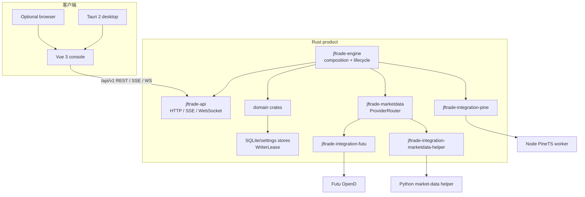
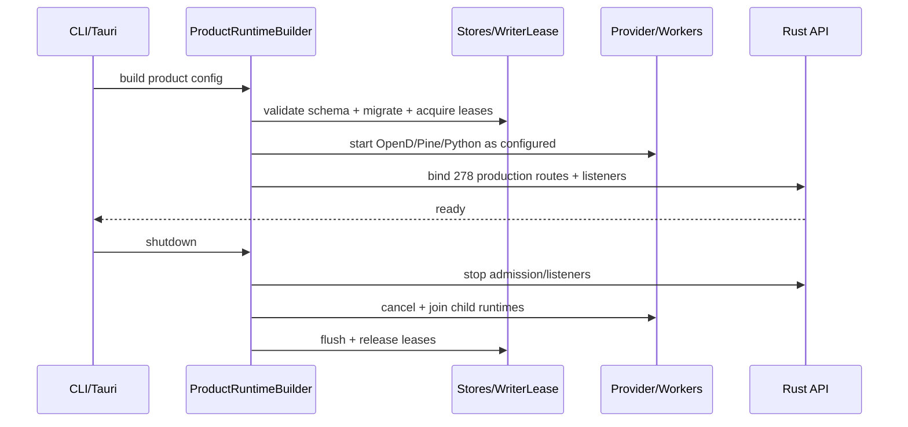
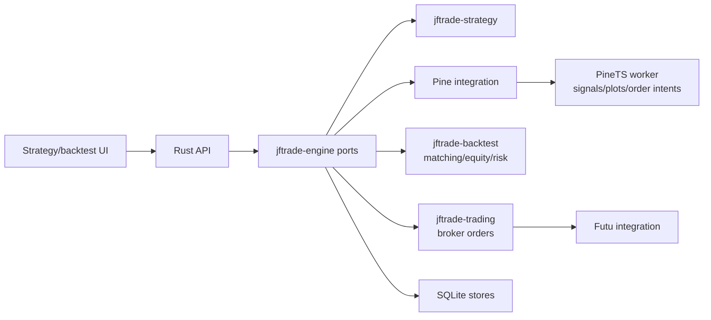
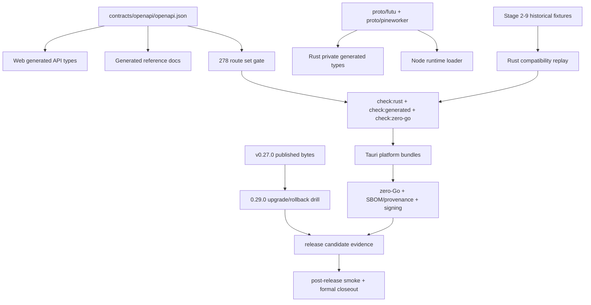
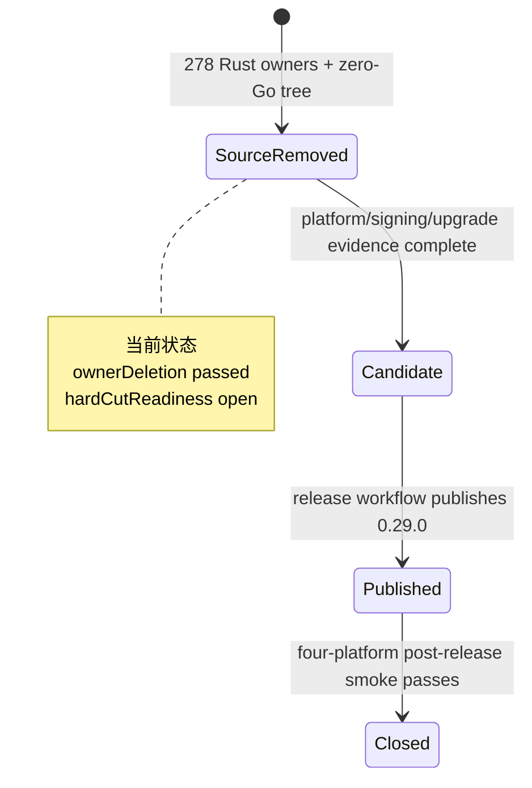

# JFTrade 架构图

更新时间：2026-09-02。本文只展示当前 Rust/Tauri 产品架构；迁移历史不进入运行图。

## 产品组件



## 启动与关闭



## 行情与实时流

```mermaid
flowchart LR
    UI[Vue pages] --> API[/market-data + SSE/WS]
    API --> Hub[LiveHub]
    Hub --> Router[ProviderRouter + DemandBook]
    Router --> Futu[OpenD push/query]
    Router --> Python[yfinance/AKShare polling]
    Router --> Cache[normalized cache]
    Cache --> Hub
```

## 策略、回测与交易



## 契约和发布链



## 状态边界



历史文档和 fixture 可以记录 Go 来源，但不连接到当前产品图，也不参与 route owner 或 release status 计算。
