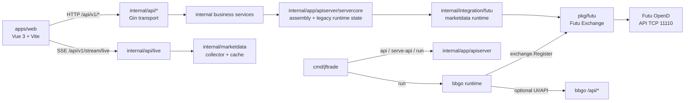

# 当前系统架构

本文只回答三个问题：

- 系统现在由哪些组件组成
- 请求和实时数据分别走哪条链路
- 后续开发该从哪个边界进入，才不会把 sidecar、bbgo 和前端职责混在一起

协议细节、K 线边界和排障案例分别下沉到专题文档。

## 一句话概括

JFTrade 当前是一个“双运行时”系统：

- 前端控制台使用 JFTrade API sidecar，入口由 `cmd/jftrade-api` 或 `cmd/jftrade` 装配到 `internal/app/apiserver`，HTTP transport 位于 `internal/api/*`，业务能力位于 `internal/{system,settings,marketdata,trading,strategy,backtest,assistant}`。
- 策略执行和交易运行时继续复用 bbgo 公开扩展点，`cmd/jftrade run` 会先启动 JFTrade sidecar，再进入 bbgo runtime。

历史上的 `pkg/jftradeapi` 兼容门面已经删除。旧文档或旧测试命令如果仍指向 `pkg/jftradeapi`，应迁移到 `internal/app/apiserver/servercore`、`internal/api/*` 或对应业务 service。

## 组件关系



## 运行模式

[cmd/jftrade/main.go](../cmd/jftrade/main.go) 当前支持两种主路径。

| 模式 | 入口 | 主要用途 | 核心组件 |
| --- | --- | --- | --- |
| API-only | `go run ./cmd/jftrade api`、`go run ./cmd/jftrade serve-api` 或 `JFTRADE_API_ONLY=1` | 前端开发、配置调试、行情与通知调试 | `cmd/jftrade` -> `internal/app/apiserver` -> `internal/api/*` -> services -> integrations |
| bbgo run | `go run ./cmd/jftrade run --config ./config/jftrade.yaml` | 策略运行、交易运行时、完整 bbgo 集成 | `cmd/jftrade` -> sidecar + bbgo runtime -> `pkg/futu` |

当前默认开发心智应是：

- 前端和控制台功能优先围绕 API-only 模式理解。
- 交易运行时和策略行为优先围绕 bbgo run 模式理解。
- JFTrade sidecar `/api/v1/*` 与 bbgo 原生 `/api/*` 可以共存，但不是同一套 API。

## 核心职责边界

### 1. `cmd/jftrade` 与 `cmd/jftrade-api`

职责：决定进程以哪种模式启动，并把控制权交给应用装配层。

- `cmd/jftrade-api`：独立 API sidecar。
- `cmd/jftrade api` / `serve-api`：只启动 sidecar。
- `cmd/jftrade run`：先尝试启动 sidecar，再进入 bbgo `cmd.Execute()`。

入口不是业务层，不实现行情、设置、策略或协议逻辑。

### 2. `internal/app/apiserver`

职责：API sidecar 的启动、依赖装配、运行时目录、配置落地和关闭顺序。

- `lifecycle`：API-only 与 bbgo run 模式下的 sidecar 生命周期。
- `runtime`：运行时路径、环境变量和 OpenD 配置注入。
- `servercore`：当前仍承载旧 Server 聚合体、store/runtime 适配和路由装配，是后续继续收口的重点区域。

### 3. `internal/api/*`

职责：提供 `/api/v1/*` 的 HTTP/SSE/WebSocket transport。

Handler 只做参数绑定、校验、调用 service、错误映射和响应转换。它们不直接访问 SQLite、Futu protobuf、OpenD client 或具体集成实现。

### 4. 业务 service

职责：承载控制台业务能力。

- `internal/system`：系统状态、OpenD 诊断、存储概览、风控状态。
- `internal/settings`：设置读写、归一化和 side-effect 触发点。
- `internal/marketdata`：订阅、tick cache、collector、快照/K 线/depth 门面。
- `internal/trading`：broker 读写、execution 命令和订单更新编排。
- `internal/strategy`：策略定义、实例目录、插件目录和 runtime 控制面。
- `internal/backtest`：回测运行、同步任务和历史数据同步门面。
- `internal/assistant`：ADK session、run、approval、provider、agent、skill、metrics。

业务 service 通过小接口依赖外部能力，不反向 import `internal/api/*`。

### 5. `internal/integration/*` 与 `pkg/*`

`internal/integration/futu` 是 sidecar 内部使用的 Futu/OpenD 适配层，负责 exchange 创建、stream/query 调用和协议到业务 DTO 的转换。

`pkg/futu` 仍是共享 Futu exchange adapter，同时服务 bbgo exchange factory 和 JFTrade sidecar 集成。`pkg/strategy`、`pkg/backtest`、`pkg/adk` 等仍保留稳定或迁移中的可复用能力；是否继续内移以外部复用需求为准。

## 请求与数据流

### 设置与系统状态

```text
apps/web
  -> /api/v1/settings/* 或 /api/v1/system/*
  -> internal/api/settings 或 internal/api/system
  -> internal/settings.Service 或 internal/system.Service
  -> internal/app/apiserver/servercore 装配的 store/runtime provider
```

`/api/v1/system/status` 现在同时返回基础状态和轻量观测摘要，包括 API uptime、实时连接统计、行情 collector 状态、broker descriptor 与 strategy runtime summary。

### 策略设计与运行控制

```text
apps/web
  -> /api/v1/strategy-definitions/* 或 /api/v1/strategies/*
  -> internal/api/strategy
  -> internal/strategy.Service
  -> servercore strategy design/catalog/runtime adapters
  -> pkg/strategy Pine parser / IR / runtime
```

策略定义同时保存 Pine 源码和可选 `visualModel`。前端生成 Pine，后端统一解析、规划并交给 Go runtime 消费。

### 实时行情链路

```text
apps/web
  -> SSE /api/v1/stream/live 或 WS /api/v1/ws/live
  -> internal/api/live
  -> internal/marketdata.Service collector + cache + active-demand merge
  -> internal/integration/futu marketdata runtime
  -> futu.Exchange.NewStream() / QueryTickers()
  -> Futu OpenD
```

`internal/marketdata` 拥有 demand、cache、freshness、fallback polling、backoff、health/reset/close。`internal/integration/futu` 只负责 Futu/OpenD 访问与协议转换。

### K 线、快照与盘口深度

```text
apps/web
  -> /api/v1/market-data/*
  -> internal/api/marketdata
  -> internal/marketdata.Service
  -> internal/integration/futu / pkg/futu
  -> Futu OpenD
```

K 线的 bucket 归一、未收盘桶补齐、tick 驱动实时叠加详见 [frontend-kline.md](frontend-kline.md)。

### Assistant/ADK

```text
apps/web
  -> /api/v1/adk/* JSON/SSE
  -> internal/api/assistant
  -> internal/assistant.Service
  -> pkg/adk.Runtime
```

HTTP transport 不依赖 Futu、protobuf 或旧 sidecar 门面。ADK runtime 装配目前仍在 `servercore`，后续可继续内移到更窄的 assembly 包。

### 通知链路

```text
Futu OpenD protocol 1003 / bbgo.Notify(...)
  -> servercore notification bridge
  -> internal/live ReplayPublisher
  -> /api/v1/stream/live
  -> apps/web Notification Center
```

## 当前约束与设计取舍

### 非侵入式 bbgo 接入仍然成立

- `pkg/futu` 在 `init()` 中注册到 bbgo exchange factory。
- `cmd/jftrade` 复用 bbgo CLI 入口。
- 不支持的交易所能力通过 `ErrNotSupported` 明确暴露。

### sidecar 与 bbgo server 不等价

维护文档和实现时必须区分：

- bbgo 原生 server 主要是 `/api/*`
- JFTrade 控制台主要使用 `/api/v1/*`
- 两者可以共存，但职责不同

任何需求如果直接假设“前端应改去接 bbgo 原生接口”，都需要先重新审查是否破坏现有控制台契约。

### Futu 适配层是共享依赖

`pkg/futu` 同时服务 bbgo 和 sidecar。改这里时必须先判断是：

- 改 bbgo 交易所抽象行为
- 改 sidecar 行情/连接行为
- 还是同时影响两者

## 后续开发入口

1. 改启动方式、运行模式、环境变量：先看 [../cmd/jftrade/main.go](../cmd/jftrade/main.go) 和 [../internal/app/apiserver](../internal/app/apiserver)。
2. 改前端 API、系统状态、设置：先看 [../internal/api](../internal/api)、[../internal/system](../internal/system)、[../internal/settings](../internal/settings)。
3. 改策略定义、模板、Pine/Logic Flow 同步：先看 [../internal/api/strategy](../internal/api/strategy)、[../internal/strategy](../internal/strategy)、[../apps/web/src/pages/StrategyPage.vue](../apps/web/src/pages/StrategyPage.vue) 和 [../apps/web/src/features/strategyVisualBuilder.ts](../apps/web/src/features/strategyVisualBuilder.ts)。
4. 改行情订阅、实时推送、通知：先看 [../internal/marketdata](../internal/marketdata)、[../internal/api/live](../internal/api/live) 和 [../internal/integration/futu](../internal/integration/futu)。
5. 改 Futu 协议、映射、连接：先看 [../pkg/futu/exchange.go](../pkg/futu/exchange.go) 与 reference 层文档。
6. 改实时 K 线：先看 [frontend-kline.md](frontend-kline.md)。
7. 改 Assistant/ADK HTTP 契约：先看 [../internal/api/assistant](../internal/api/assistant) 和 [../internal/assistant](../internal/assistant)。

## 相关文档

- [README.md](README.md)：docs 阅读入口
- [architecture/backend-layout-v1.md](architecture/backend-layout-v1.md)：后端目录拆包与迁移记录
- [architecture/backend-coding-standards.md](architecture/backend-coding-standards.md)：后端分层代码规范
- [troubleshooting.md](troubleshooting.md)：排障入口
- [frontend/strategy-authoring.md](frontend/strategy-authoring.md)：前端策略设计专题
- [frontend-kline.md](frontend-kline.md)：前端行情与 K 线专题入口
- [reference/README.md](reference/README.md)：协议与参考资料入口
