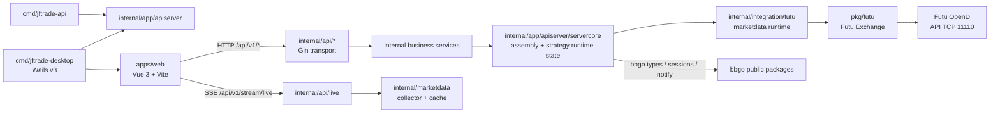

# 当前系统架构

本文面向需要改代码的维护者，说明三件事：

- 系统现在由哪些组件组成
- 请求和实时数据分别走哪条链路
- 后续开发该从哪个边界进入，避免把前端、后端服务和底层 bbgo 公共包混在一起

协议细节、K 线边界和排障案例分别下沉到专题文档。

## 一句话概括

JFTrade 当前以一个本地后端服务为核心。它既可以由 `cmd/jftrade-api` 独立启动，也可以由 Wails `cmd/jftrade-desktop` 作为桌面 sidecar 管理。下文仍用 sidecar 指这个后端服务。

- 前端控制台使用 JFTrade 后端服务，`cmd/jftrade-api` 和 `cmd/jftrade-desktop` 都装配到 `internal/app/apiserver`；HTTP 层位于 `internal/api/*`，业务能力位于 `internal/{system,settings,marketdata,trading,strategy,backtest,assistant,watchlist}`。
- Wails 桌面壳不替换业务 transport：Vue 仍直接访问 REST、SSE 和 WebSocket；bindings 仅承载链接、桌面日志和更新检查。
- 策略执行、回测、行情和通知仍复用 bbgo 的公共类型、stream、backtest engine 和通知总线，但不再提供独立 bbgo CLI/full runtime 入口。

历史上的 `pkg/jftradeapi` 兼容门面已经删除。旧文档或旧测试命令如果仍指向 `pkg/jftradeapi`，应迁移到 `internal/app/apiserver/servercore`、`internal/api/*` 或对应业务 service。

## 组件关系



## 运行模式

`cmd/jftrade-api` 是独立 API 入口；`cmd/jftrade-desktop` 是 Wails v3 产品入口。两者复用 `internal/app/apiserver`，不会形成第二套业务 API。

| 模式           | 入口                       | 主要用途                                         | 核心组件                                                                                      |
| -------------- | -------------------------- | ------------------------------------------------ | --------------------------------------------------------------------------------------------- |
| API 后端服务   | `go run ./cmd/jftrade-api` | 前端开发、配置调试、行情、策略运行控制与通知调试 | `cmd/jftrade-api` -> `internal/app/apiserver` -> `internal/api/*` -> services -> integrations |
| Wails 桌面开发 | `pnpm run desktop:dev`      | 桌面联调，同时保留仓库开发数据                   | `JFTrade Dev` -> Vite -> loopback sidecar `3008`；可选 Web 监听器使用用户端口                  |
| Wails 正式产品 | `release_assets` 构建      | 独立安装的桌面产品                               | `JFTrade` -> embedded frontend -> loopback sidecar `6699`；可选 Web 默认 `6688`                |

当前默认按下面理解：

- 前端、控制台、策略运行控制和交易链路都先经过 JFTrade API 后端服务。
- Wails sidecar 与可选 Web 入口是两个监听器，但复用同一个 Gin handler、服务层和数据目录；sidecar 始终只监听 loopback，不能被 Web 密码当作浏览器入口。
- JFTrade 控制台只承诺 `/api/v1/*`；不要把它和 bbgo 原生 `/api/*` 混为一谈。
- `pkg/futu`、`pkg/strategy/pineworker`、`pkg/backtest` 仍可复用 bbgo 公共类型、PineTS worker 边界和回测组件。

## 核心职责边界

### 1. 进程入口

职责：决定进程以哪种模式启动，并把控制权交给应用装配层。

- `cmd/jftrade-api`：独立 API 后端服务入口。
- `cmd/jftrade-desktop`：Wails v3 桌面入口，集中解析 build profile、运行配置、临时桌面 API 凭证、单实例和窗口生命周期。
- 历史 full 模式入口已移除。

入口不是业务层，不实现行情、设置、策略或协议逻辑。

### 2. `internal/app/apiserver`

职责：API sidecar 的启动、依赖装配、运行时目录、配置落地和关闭顺序。

- `lifecycle`：API sidecar 生命周期。
- `runtime`：运行时路径、环境变量和 OpenD 配置注入。
- `servercore`：当前仍承载旧 Server 聚合体、store/runtime 适配和路由装配，是后续继续收口的重点区域。

### 3. `internal/api/*`

职责：提供 `/api/v1/*` 的 HTTP/SSE/WebSocket transport。

Handler 只做参数绑定、校验、调用 service、错误映射和响应转换。它们不直接访问 SQLite、Futu protobuf、OpenD client 或具体集成实现。

### 4. 业务 service

职责：承载控制台业务能力。

- `internal/system`：系统状态、OpenD 诊断、存储概览、风控状态。
- `internal/settings`：设置读写、归一化和 side-effect 触发点。
- `internal/marketdata`：订阅、tick cache、collector、快照/K 线/depth 门面。
- `internal/trading`：broker 读写、execution 命令和订单更新编排。
- `internal/strategy`：策略定义、实例目录、插件目录和 runtime 控制面。
- `internal/backtest`：回测运行、同步任务和历史数据同步门面。
- `internal/assistant`：ADK session、run、approval、provider、agent、skill、metrics。
- `internal/watchlist`：本地多分组自选、membership revision、券商导入一致性和批量快照编排。

业务 service 通过小接口依赖外部能力，不反向 import `internal/api/*`。

### 5. `internal/integration/*` 与 `pkg/*`

`internal/integration/futu` 是 sidecar 内部使用的 Futu/OpenD 适配层，负责 exchange 创建、stream/query 调用和协议到业务 DTO 的转换。

`pkg/futu` 仍是 Futu exchange adapter，保留 bbgo `types.Exchange` 兼容面以服务 sidecar、回测和策略 runtime。`pkg/strategy`、`pkg/backtest`、`pkg/adk` 等仍保留稳定或迁移中的可复用能力；是否继续内移以外部复用需求为准。

### 6. 桌面专属边界

`cmd/jftrade-desktop` 只暴露三个 bindings 服务：外部链接、分页桌面日志和更新检查。生成的 TypeScript bindings 位于 `apps/web/src/wails`。窗口位置、尺寸和最大化状态写入正式产品数据目录的 `desktop-state.json`；开发版与产品版使用不同 Product/SingleInstance ID，允许同时运行。

## 请求与数据流

### 设置与系统状态

```text
apps/web
  -> /api/v1/settings/* 或 /api/v1/system/*
  -> internal/api/settings 或 internal/api/system
  -> internal/settings.Service 或 internal/system.Service
  -> internal/app/apiserver/servercore 装配的 store/runtime provider
```

`/api/v1/system/status` 现在同时返回基础状态和轻量观测摘要，包括 API uptime、实时连接统计、行情 collector 状态、broker descriptor 与 strategy runtime summary。

### 策略设计与运行控制

```text
apps/web
  -> /api/v1/strategy-definitions/* 或 /api/v1/strategies/*
  -> internal/api/strategy
  -> internal/strategy.Service
  -> servercore strategy design/catalog/runtime adapters
  -> pkg/strategy Pine parser / spec / PineTS worker runtime
```

策略定义同时保存 Pine 源码和可选 `visualModel`。前端生成 Pine，后端统一解析、规划并交给 PineTS worker 执行；Go 侧保留调度、回测撮合、风控和订单边界。

### 实时行情链路

```text
apps/web
  -> SSE /api/v1/stream/live 或 WS /api/v1/ws/live
  -> internal/api/live
  -> internal/marketdata.Service collector + cache + active-demand merge
  -> internal/integration/futu marketdata runtime
  -> futu.Exchange.NewStream() / QueryTickers()
  -> Futu OpenD
```

`internal/marketdata` 拥有 demand、cache、freshness、fallback polling、backoff、health/reset/close。`internal/integration/futu` 只负责 Futu/OpenD 访问与协议转换。

### K 线、快照与盘口深度

```text
apps/web
  -> /api/v1/market-data/*
  -> internal/api/marketdata
  -> internal/marketdata.Service
  -> internal/integration/futu / pkg/futu
  -> Futu OpenD
```

K 线的 bucket 归一、未收盘桶补齐、tick 驱动实时叠加详见 [frontend-kline.md](frontend-kline.md)。

### 自选与券商导入

```text
apps/web
  -> /api/v1/watchlist/*
  -> internal/api/watchlist
  -> internal/watchlist.Service
  -> internal/store/watchlist -> watchlists.db
  -> WatchlistSourceReader / BatchSnapshotSource
  -> pkg/futu -> Futu OpenD
```

`watchlists.db` 是唯一主数据。Futu 3213/3222 只承担远端分组发现与预览导入，3203 `SecuritySnapshot` 只承担可见行报价；自选行情不进入实时 collector demand 或 BasicQot 订阅。完整边界见 [watchlist.md](watchlist.md)。

### Assistant/ADK

```text
apps/web
  -> /api/v1/adk/* JSON/SSE
  -> internal/api/assistant
  -> internal/assistant.Service
  -> pkg/adk.Runtime
```

HTTP transport 不依赖 Futu、protobuf 或旧 sidecar 门面。ADK runtime 装配目前仍在 `servercore`，后续可继续内移到更窄的 assembly 包。

### 通知链路

```text
Futu OpenD protocol 1003 / bbgo.Notify(...)
  -> servercore notification bridge
  -> internal/live ReplayPublisher
  -> /api/v1/stream/live
  -> apps/web Notification Center
```

## 当前约束与设计取舍

### bbgo 公共能力复用仍然成立

- `pkg/futu` 实现 bbgo `types.Exchange` 等公开接口。
- PineTS worker 通过 `pkg/strategy/pineworker` 接入策略执行边界；Go 主进程不再维护自研 Pine 执行 runtime。
- `pkg/backtest` 复用 bbgo backtest engine，并通过 Pine worker 结果进入 Go 撮合、资金曲线和指标统计。
- 不支持的交易所能力通过 `ErrNotSupported` 明确暴露。

### sidecar 与 bbgo server 不等价

维护文档和实现时必须区分：

- JFTrade 控制台主要使用 `/api/v1/*`
- bbgo 原生 server 的 `/api/*` 不是 JFTrade 当前运行模式的一部分

任何需求如果直接假设“前端应改去接 bbgo 原生接口”，都需要先重新审查是否破坏现有控制台契约。

### Futu 适配层是共享依赖

`pkg/futu` 同时服务 sidecar、PineTS worker 调度前后的行情/交易边界和回测。改这里时必须先判断是：

- 改 sidecar 行情/连接行为
- 改策略执行调度 / 回测依赖的 exchange 行为
- 还是同时影响多个调用方

## 后续开发入口

1. 改独立 API 启动方式、运行模式、环境变量：先看 [../cmd/jftrade-api/main.go](../cmd/jftrade-api/main.go) 和 [../internal/app/apiserver](../internal/app/apiserver)。
2. 改桌面 profile、菜单、bindings、窗口状态或更新：先看 [../cmd/jftrade-desktop](../cmd/jftrade-desktop)、[../internal/desktop](../internal/desktop) 和 [troubleshooting/desktop-release.md](troubleshooting/desktop-release.md)。
3. 改前端 API、系统状态、设置：先看 [../internal/api](../internal/api)、[../internal/system](../internal/system)、[../internal/settings](../internal/settings)。
4. 改策略定义、模板、Pine/Logic Flow 同步：先看 [../internal/api/strategy](../internal/api/strategy)、[../internal/strategy](../internal/strategy)、[../apps/web/src/pages/StrategyPage.vue](../apps/web/src/pages/StrategyPage.vue) 和 [../apps/web/src/features/strategyVisualBuilder.ts](../apps/web/src/features/strategyVisualBuilder.ts)。
5. 改行情订阅、实时推送、通知：先看 [../internal/marketdata](../internal/marketdata)、[../internal/api/live](../internal/api/live) 和 [../internal/integration/futu](../internal/integration/futu)。
6. 改 Futu 协议、映射、连接：先看 [../pkg/futu/exchange.go](../pkg/futu/exchange.go) 与 reference 层文档。
7. 改实时 K 线：先看 [frontend-kline.md](frontend-kline.md)。
8. 改 Assistant/ADK HTTP 契约：先看 [../internal/api/assistant](../internal/api/assistant) 和 [../internal/assistant](../internal/assistant)。
9. 改自选领域、券商导入、星标或自选快照：先看 [watchlist.md](watchlist.md)、[../internal/watchlist](../internal/watchlist) 和 [../internal/api/watchlist](../internal/api/watchlist)。

## 相关文档

- [README.md](README.md)：docs 阅读入口
- [architecture/backend-layout-v1.md](architecture/backend-layout-v1.md)：后端目录拆包与迁移记录
- [architecture/backend-coding-standards.md](architecture/backend-coding-standards.md)：后端分层代码规范
- [troubleshooting.md](troubleshooting.md)：排障入口
- [frontend/strategy-authoring.md](frontend/strategy-authoring.md)：前端策略设计专题
- [frontend-kline.md](frontend-kline.md)：前端行情与 K 线专题入口
- [watchlist.md](watchlist.md)：自选、导入、行情与 ADK 专题
- [reference/README.md](reference/README.md)：协议与参考资料入口
