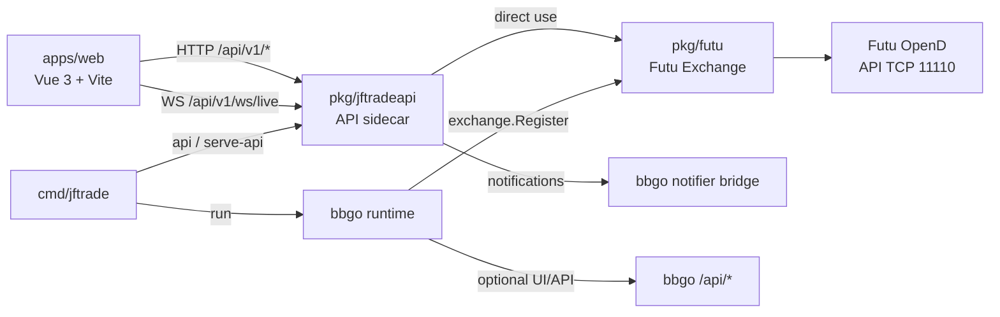

# 当前系统架构

本文只回答三个问题：

- 系统现在由哪些组件组成
- 请求和实时数据分别走哪条链路
- 后续开发该从哪个边界进入，才不会把 sidecar、bbgo 和前端职责混在一起

协议细节、K 线细枝末节、排障案例不再放在本文，分别下沉到专题文档。

## 一句话概括

JFTrade 当前是一个“双核心”系统：

- 一条是基于 [pkg/jftradeapi](../pkg/jftradeapi) 的前端 API sidecar，负责 `/api/v1/*`、设置持久化、行情查询、实时推送和兼容层。
- 一条是基于 bbgo 的运行时，负责策略执行、交易抽象和 bbgo 原生运行模式。

两条链路都复用 [pkg/futu](../pkg/futu) 作为 Futu 适配层，但入口和职责不同。

## 组件关系



## 运行模式

[cmd/jftrade/main.go](../cmd/jftrade/main.go) 当前支持两种主路径。

| 模式 | 入口 | 主要用途 | 核心组件 |
| --- | --- | --- | --- |
| API-only | `go run ./cmd/jftrade api` 或 `JFTRADE_API_ONLY=1` | 前端开发、配置调试、行情与通知调试 | `cmd/jftrade` -> `pkg/jftradeapi` -> `pkg/futu` -> OpenD |
| bbgo run | `go run ./cmd/jftrade run --config ./config/jftrade.yaml` | 策略运行、交易运行时、完整 bbgo 集成 | `cmd/jftrade` -> bbgo runtime -> `pkg/futu`，并同时启动 sidecar |

当前默认开发心智应是：

- 前端和控制台功能优先围绕 API-only 模式理解。
- 交易运行时和策略行为优先围绕 bbgo run 模式理解。

## 核心职责边界

### 1. cmd/jftrade

职责：决定进程以哪种模式启动。

- 在 API-only 模式下，只启动 sidecar。
- 在 run 模式下，先尝试启动 sidecar，再进入 bbgo `cmd.Execute()`。
- 统一补默认环境，例如 `DISABLE_MARKETS_CACHE=1`。

它不是业务层，不负责实现行情、设置或协议逻辑。

### 2. pkg/jftradeapi

职责：提供面向前端的控制平面和兼容 API。

它当前承载：

- `/api/v1/settings/*`：Broker 配置持久化和运行时注入
- `/api/v1/system/*`：状态、诊断、OpenD 探针、通知
- `/api/v1/market-data/*`：订阅、快照、K 线查询
- `/api/v1/strategy-definitions/*`：QuickJS 策略定义、实例化、visualModel 持久化
- `/api/v1/ws/live`：实时心跳、tick、系统通知
- 与 bbgo notifier 的桥接缓存

这里是前端默认依赖的 API 面，不是 bbgo 原生 `/api/*` 的镜像。

### 3. pkg/futu

职责：把 Futu OpenD 包装成可复用的交易所适配层。

它有两种被使用的方式：

- 被 bbgo 通过 `exchange.Register("futu", ...)` 当作交易所插件实例化。
- 被 sidecar 直接创建 `futu.Exchange`，用于行情查询、实时订阅和 OpenD 探针。

因此这里既是 bbgo 集成点，也是 sidecar 的 broker 访问层。

### 4. bbgo runtime

职责：策略运行、交易抽象和 bbgo 生命周期管理。

当前文档要避免的常见误判是：

- 不是所有前端请求都走 bbgo `/api/*`
- JFTrade 前端主要依赖的是 sidecar `/api/v1/*`
- bbgo 自带 server 不是当前控制台的唯一后端

### 5. apps/web

职责：提供控制台 UI，消费 sidecar 的 REST、SSE、WebSocket 能力。

前端应优先假设：

- 设置、诊断、实时通知来自 sidecar
- 行情快照和 K 线查询来自 sidecar
- 实时 tick 来自 `/api/v1/ws/live`
- 策略设计工作区同时承载 Logic Flow visualModel 与 QuickJS script，浏览器内代码编辑使用 Monaco，测试环境回退 textarea

## 请求与数据流

### 设置与系统状态

```text
apps/web
  -> /api/v1/settings/* 或 /api/v1/system/*
  -> pkg/jftradeapi
  -> SettingsStore / runtime env / OpenD probe
```

这一层主要是控制平面，不等同于交易执行。

### 策略设计与运行控制

```text
apps/web
  -> /api/v1/strategy-definitions/*
  -> pkg/jftradeapi/strategy_routes.go
  -> strategy_design_store / strategy_catalog_store
  -> QuickJS strategy definition + optional visualModel persistence
```

这条链路当前有四个重要约束：

- 策略定义同时保存 QuickJS script 和可选 `visualModel`，两者都属于控制平面数据。
- 前端支持 Logic Flow 可视化编辑和纯代码编辑，但当前没有“代码反解回图”的能力。
- 加载已有定义时保留已保存脚本；只有显式同步或修改图块参数后，才会重新生成 QuickJS。
- 设计页的浏览器代码编辑器使用 Monaco，但前端测试仍走 textarea 回退，避免 jsdom 初始化重量级编辑器。

### 实时行情链路

```text
apps/web
  -> WebSocket /api/v1/ws/live
  -> pkg/jftradeapi/live dispatcher
  -> market subscription manager
  -> futu.Exchange.NewStream() / QueryTickers()
  -> Futu OpenD
```

这条链路有两个关键特征：

- 优先使用 OpenD push 流维持实时性。
- 当样本不够新时，sidecar 会回退到 `QueryTickers()` 做补采样。

因此实时行情不是“纯 WebSocket 推送”或“纯 HTTP 轮询”，而是由 sidecar 统一调度的混合链路。

### K 线与快照链路

```text
apps/web
  -> /api/v1/market-data/candles/* 与 /api/v1/market-data/snapshots/*
  -> pkg/jftradeapi
  -> futu.Exchange
  -> Futu OpenD 历史/快照查询
  -> sidecar 归一化后返回前端
```

K 线的桶时间归一化、当前未收盘桶补齐、tick 驱动的实时叠加，都属于专题问题，详见 [frontend-kline.md](frontend-kline.md)。

### 通知链路

```text
Futu OpenD protocol 1003 / bbgo.Notify(...)
  -> pkg/jftradeapi notification cache
  -> /api/v1/ws/live
  -> apps/web Notification Center
```

sidecar 当前负责把 Futu 系统通知和 bbgo 通知收束到同一条前端消费链路。

## 当前约束与设计取舍

### 非侵入式 bbgo 接入仍然成立

本项目仍然保持“不改 bbgo 源码、通过公开扩展点接入”的原则：

- `pkg/futu` 在 `init()` 中注册到 bbgo exchange factory。
- `cmd/jftrade` 复用 bbgo CLI 入口。
- 不支持的交易所能力通过 `ErrNotSupported` 明确暴露，而不是伪实现。

但这已经不是系统全貌。当前真实系统还包括 sidecar 这条前端兼容层和控制平面。

### sidecar 与 bbgo server 不等价

维护文档和实现时必须区分：

- bbgo 原生 server 主要是 `/api/*`
- JFTrade 控制台主要使用 `/api/v1/*`
- 两者可以共存，但职责不同

任何需求如果直接假设“前端应改去接 bbgo 原生接口”，都需要先重新审查是否破坏现有控制台契约。

### Futu 适配层是共享依赖，不是单一插件

`pkg/futu` 既服务 bbgo，也服务 sidecar。改这里时必须先判断是：

- 改 bbgo 交易所抽象行为
- 改 sidecar 行情/连接行为
- 还是同时影响两者

## 后续开发的入口建议

如果你准备继续开发，先按下面顺序判断定位：

1. 改启动方式、运行模式、环境变量：先看 [../cmd/jftrade/main.go](../cmd/jftrade/main.go)
2. 改前端 API、系统状态、设置：先看 [../pkg/jftradeapi/server.go](../pkg/jftradeapi/server.go)
3. 改策略定义、模板、QuickJS/Logic Flow 同步：先看 [../pkg/jftradeapi/strategy_routes.go](../pkg/jftradeapi/strategy_routes.go)、[../pkg/jftradeapi/strategy_design_store.go](../pkg/jftradeapi/strategy_design_store.go)、[../apps/web/src/pages/StrategyPage.vue](../apps/web/src/pages/StrategyPage.vue) 和 [../apps/web/src/features/strategyVisualBuilder.ts](../apps/web/src/features/strategyVisualBuilder.ts)
4. 改行情订阅、实时推送、通知：先看 [../pkg/jftradeapi/market_routes.go](../pkg/jftradeapi/market_routes.go) 和 [../pkg/jftradeapi/market_live.go](../pkg/jftradeapi/market_live.go)
5. 改 Futu 协议、映射、连接：先看 [../pkg/futu/exchange.go](../pkg/futu/exchange.go) 与 reference 层文档
6. 改实时 K 线：先看 [frontend-kline.md](frontend-kline.md)

## 相关文档

- [README.md](README.md)：docs 阅读入口
- [troubleshooting.md](troubleshooting.md)：排障入口
- [frontend/strategy-authoring.md](frontend/strategy-authoring.md)：前端策略设计专题
- [frontend-kline.md](frontend-kline.md)：前端行情与 K 线专题入口
- [reference/README.md](reference/README.md)：协议与参考资料入口
