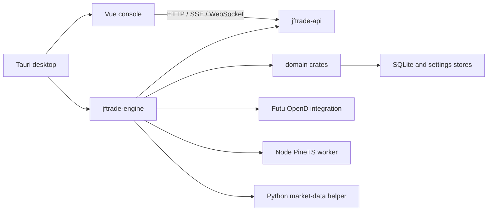

# 当前系统架构

更新时间：2026-09-03。

JFTrade 是 Rust/Tauri 本地量化产品：`jftrade-engine` 持有全部 278 条 `/api/v1/*` 生产路由和 9 个 SQLite 数据库的唯一写入权，Tauri 2 是唯一桌面壳。仓库不包含 Go 源码、模块、生成器、构建入口或运行产物。

## 组件关系

```mermaid
flowchart LR
    Desktop[Tauri desktop] --> Engine[jftrade-engine]
    Desktop --> Web[Vue console]
    Web -->|HTTP / SSE / WebSocket| API[jftrade-api]
    Engine --> API
    Engine --> Domains[domain crates]
    Domains --> Stores[SQLite and settings stores]
    Engine --> Futu[Futu OpenD integration]
    Engine --> Pine[Node PineTS worker]
    Engine --> Helper[Python market-data helper]
```

## 运行边界

| 模式 | 入口 | 边界 |
| --- | --- | --- |
| 独立 API | `cargo run -p jftrade-engine --bin jftrade-api-rust` | 默认 `127.0.0.1:3000`，使用生产 composition |
| 桌面开发 | `pnpm run dev:desktop` | Tauri 管理 Vite、Rust API 和 worker/helper |
| 桌面产品 | `pnpm run build:desktop` | embedded Web、受管 Rust API、Pine 和 market-data runtime |

前端只承诺 `/api/v1/*`。Tauri IPC 只提供受管 loopback URL、临时桌面 token、启动状态和桌面专属命令，不形成第二套业务 API。

## 组件职责

- `crates/jftrade-engine`：唯一 production composition root；负责 schema、数据库、租约、Provider、worker、production ports、路由和 listener 的装配与逆序回收。
- `crates/jftrade-api`：Axum transport、DTO、认证、Origin/CSRF、错误映射、SSE 与 WebSocket；不直接打开 SQLite 或外部协议。
- `crates/jftrade-*`：领域规则；具体存储和协议位于 `jftrade-store-*` 与 `jftrade-integration-*`。
- `apps/desktop/src-tauri`：唯一桌面入口；负责 profile、单实例、窗口、更新和受管 runtime。
- `apps/web`：Vue 3 控制台，只通过公开 API 与桌面 facade 访问能力。
- `workers/pineworker`：PineTS 信号、图形和 order intents；撮合、成交、资金曲线、风控和下单由 Rust 持有。
- `workers/marketdata-sidecar`：随安装包分发的 Python 行情 helper；不提供交易或 Level 2。

业务状态必须保持唯一写入者。内部 adapter 缺失会阻止生产启动；外部 Provider 或 OpenD 不可用时按公开契约返回 502/503，不伪造成功结果。

## 契约与持久化

`contracts/openapi/openapi.json` 是 HTTP 规范源，Node 生成前端类型和参考文档。`proto/futu` 与 `proto/pineworker` 是中立 protobuf 规范，只由当前 Rust/Node 链消费。

Rust engine 初始化并迁移 9 个 SQLite 数据库，通过 `WriterLease` 保证唯一写入权。schema drift、损坏或租约冲突均 fail closed。升级和回滚不得让旧版本直接读取不兼容的新 schema；必须恢复升级前备份。

## 质量与发布

当前门禁只按产品能力组织。冻结语料位于 `tests/fixtures/compatibility/<capability>`，由 Rust replay；OpenAPI 与实际 Rust 注册目录直接核对为 278/278，不使用人工路由 owner 账本。

具体 CI DAG、affected 兜底和本地入口见 [architecture/quality-gates.md](architecture/quality-gates.md)。签名、安装升级回滚、SBOM/provenance、安全签字和发布后验证见 [architecture/release-qualification.md](architecture/release-qualification.md)。迁移资料只保存在 [history/go-to-rust](history/go-to-rust/README.md)，不参与当前状态计算。
