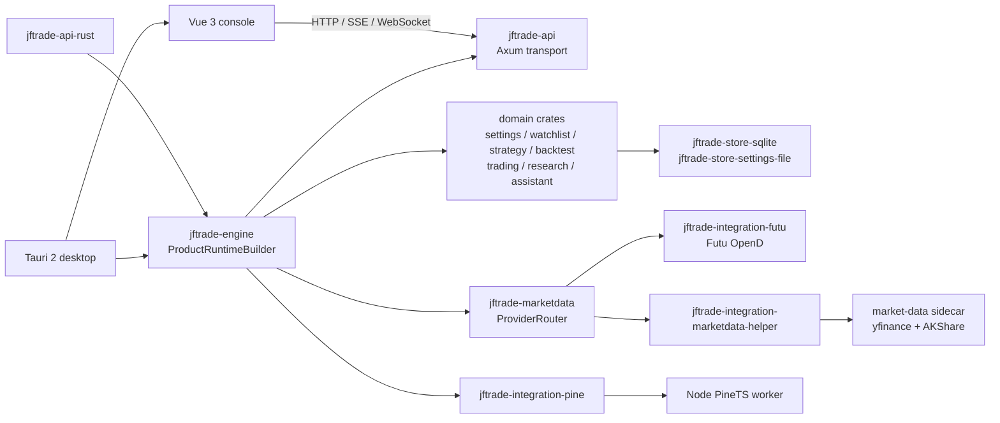

# 当前系统架构

更新时间：2026-09-02。

JFTrade 当前是零 Go 的 Rust/Tauri 产品：`jftrade-engine` 持有全部 278 条 `/api/v1/*` 生产路由、9 个 SQLite 数据库和设置文件的唯一写入权；Tauri 2 是唯一桌面壳。仓库不包含 Go 源码、模块、生成器、构建入口或运行产物，历史兼容数据只作为 Rust replay 的只读 fixture。

`0.29.0` 计划作为首个零 Go 版本。源码/入口删除已经完成，但 Stage 9 closeout 仍为 `in_progress`；四平台签名安装、从线上 `v0.27.0` 的真实升级、回滚与备份恢复、签名 updater、SBOM、安全审查和发布后 smoke 尚未闭合。当前状态不能解释为已经具备发布资格。

## 组件关系


```mermaid
flowchart LR
    CLI[jftrade-api-rust] --> Engine[jftrade-engine\nProductRuntimeBuilder]
    Desktop[Tauri 2 desktop] --> Engine
    Desktop --> Web[Vue 3 console]
    Web -->|HTTP / SSE / WebSocket| API[jftrade-api\nAxum transport]
    Engine --> API
    Engine --> Domains[domain crates\nsettings / watchlist / strategy / backtest\ntrading / research / assistant]
    Domains --> Stores[jftrade-store-sqlite\njftrade-store-settings-file]
    Engine --> Market[jftrade-marketdata\nProviderRouter]
    Market --> Futu[jftrade-integration-futu\nFutu OpenD]
    Market --> Helper[jftrade-integration-marketdata-helper]
    Helper --> Python[market-data sidecar\nyfinance + AKShare]
    Engine --> Pine[jftrade-integration-pine]
    Pine --> PineWorker[Node PineTS worker]
```

## 运行模式

| 模式 | 入口 | 用途 | 运行边界 |
| --- | --- | --- | --- |
| 独立 API | `cargo run -p jftrade-engine --bin jftrade-api-rust` | 浏览器前端开发、配置和 API 诊断 | 默认 `127.0.0.1:3000`，使用同一 Rust product composition |
| 桌面开发 | `pnpm run dev:desktop` | Tauri/Vue/受管 runtime 联调 | Tauri 管理 Vite、Rust API `3008` 和 worker/helper |
| 桌面产品 | `pnpm run build:desktop` | 原生安装包 | embedded Web、受管 Rust API `6699`、可选 Web `6688` |

前端只承诺 `/api/v1/*`。桌面 Vue 仍通过 HTTP/SSE/WebSocket 访问 Rust API；Tauri IPC 只注入受管 loopback URL、临时桌面 Bearer token、启动状态和桌面专属命令，不形成第二套业务接口。

## 核心职责

### Product composition

`crates/jftrade-engine` 是唯一生产 composition root。`ProductRuntimeBuilder` 负责 schema 校验、数据库迁移与租约、Provider/OpenD、Pine/Python worker、production ports、278 路由和 listener 的装配；失败时逆序回滚，`ProductRuntimeHandle` 统一关闭所有子资源。

内部 adapter 缺失会阻止生产启动。模型 Provider、OpenD 或外部数据源不可用时，已注册路由按公开契约返回 502/503，不通过伪成功或第二 owner 降级。

### HTTP、SSE 与 WebSocket

`crates/jftrade-api` 负责 Axum transport、wire DTO、cookie/Bearer/Origin/CSRF 校验、错误映射和 `LiveHub`。它只依赖由 engine 注入的窄 port，不直接打开 SQLite、不拥有 OpenD/worker，也不把协议生成类型泄漏到领域层。

### 领域、存储和集成

- `jftrade-settings`、`jftrade-calendar`、`jftrade-datamanagement`：设置、交易日历和数据维护规则。
- `jftrade-marketdata`、`jftrade-broker`、`jftrade-trading`：Provider demand/cache、broker 和 execution 规则。
- `jftrade-strategy`、`jftrade-backtest`、`jftrade-assistant`、`jftrade-research`、`jftrade-watchlist`：业务领域与 port。
- `jftrade-store-sqlite`、`jftrade-store-settings-file`：生产持久化、migration 和唯一 writer lease。
- `jftrade-integration-futu`、`jftrade-integration-pine`、`jftrade-integration-marketdata-helper`：外部协议和进程边界。

Futu protobuf 只在 `jftrade-integration-futu` 内生成和使用；Pine protobuf 只在 Pine integration/worker 边界使用。中立规范位于 `proto/`。

### 桌面与运行资产

`apps/desktop/src-tauri` 是唯一桌面入口，负责 profile、单实例、窗口、更新和受管 Rust runtime。发布输入统一准备到 `runtime-assets/{web,pine,marketdata}`；安装包不得包含废弃桌面运行时或 Go build info。

Python market-data helper 由 PyInstaller 打成 `onedir`，按平台随 Tauri 发布，并由 Rust 校验 SHA-256、缓存和管理生命周期。Node PineTS worker 只产生信号、图形和 order intents；撮合、成交、资金曲线、风控和券商下单由 Rust engine 持有。

## 主要数据流

### 设置与系统状态

```text
apps/web
  -> /api/v1/settings/* 或 /api/v1/system/*
  -> jftrade-api
  -> jftrade-engine production ports
  -> jftrade-settings / settings store / runtime status
```

### 策略与回测

```text
apps/web
  -> /api/v1/strategy-definitions/*、/api/v1/strategies/*、/api/v1/backtests/*
  -> jftrade-api
  -> jftrade-engine
  -> strategy/backtest domains + SQLite stores
  -> jftrade-integration-pine -> PineTS worker
```

策略定义保存 Pine 源码和可选 `visualModel`。PineTS 负责执行与信号；Rust 固定 Provider、撮合模型、风险和订单边界。

### 行情、实时流与交易

```text
apps/web
  -> /api/v1/market-data/*、SSE /stream/live、WS /ws/live
  -> jftrade-api LiveHub
  -> jftrade-engine
  -> jftrade-marketdata ProviderRouter
     -> jftrade-integration-futu -> OpenD
     -> jftrade-integration-marketdata-helper -> yfinance / AKShare
```

`ProviderRouter` 拥有逻辑 demand、cache、freshness 和 Provider 状态。Provider 切换先验证再原子提交；失败保持旧 owner。Futu 可使用 push，Python Provider 只轮询且不提供交易或 Level 2。

### Assistant/ADK

```text
apps/web -> /api/v1/adk/* JSON/SSE
  -> jftrade-api
  -> jftrade-engine ADK ports
  -> jftrade-assistant + ADK/session/artifact stores
  -> configured model provider / MCP listener
```

模型 Provider 未配置或不可用时返回明确 503，不生成伪结果。审批、任务、session、artifact 和通知都只有 Rust owner。

## 契约与兼容证据

- `contracts/openapi/openapi.json` 是语言无关的公开 HTTP 规范源；Node 生成 Web 类型和参考文档。
- `proto/futu` 与 `proto/pineworker` 是中立 protobuf 规范；只保留 Rust/Node 消费链。
- `tests/fixtures/rust-migration/stage2` 至 `stage9` 是历史迁移产生的不可变兼容输入；当前 required checks 只运行 Rust/Node replay，不再生成新的 Go oracle。
- `tests/fixtures/rust-migration/stage9/last-go-release-baseline.json` 记录线上最后一个正式 Go 版本 `v0.27.0` 的 tag、commit、发布资产和官方 checksum。升级/回滚资格必须使用这些已发布字节，禁止从历史源码重建基线。
- `route-ownership.json`、Rust production route manifest 和 OpenAPI 必须保持 278 路由集合一致。

## 零 Go 与发布边界

`check:go-retirement` 是从迁移起点开始的单调递减账本；`check:zero-go` 是最终不变量，覆盖受版本控制的源码/模块、构建脚本和 CI，并由 Tauri bundle、candidate input 与 SBOM/provenance 检查器复用。历史文档和 fixture 可以说明来源，但不参与当前 owner、路由或发布状态计算。

源码删除不等同于发布资格。只有 closeout 中平台发布、签名 updater、安全、SBOM、升级/回滚、备份恢复和 post-release smoke 都有与 release ref/commit/产物绑定的真实证据，`hardCutReadiness` 才能通过并允许创建 `0.29.0` tag。

## 后续开发入口

1. API 启动、装配和生命周期：`crates/jftrade-engine`、`crates/jftrade-api`。
2. Tauri profile、IPC、窗口或更新：`apps/desktop/src-tauri`。
3. 前端请求和页面状态：`apps/web` 与 `docs/frontend/*`。
4. Futu/OpenD：`crates/jftrade-integration-futu` 与 `proto/futu`。
5. PineTS：`crates/jftrade-integration-pine`、`workers/pineworker` 与 `proto/pineworker`。
6. Python 行情：`crates/jftrade-integration-marketdata-helper` 与 `workers/marketdata-sidecar`。
7. 发布收口：`docs/roadmap.md`、迁移事实源和 Stage 9 closeout manifest。

## 相关文档

- [README.md](README.md)：维护者导航
- [architecture/go-to-rust-migration.md](architecture/go-to-rust-migration.md)：迁移完成状态与 `0.29.0` 放行边界
- [architecture/rust-migration-execution-playbook.md](architecture/rust-migration-execution-playbook.md)：零 Go closeout 执行协议
- [roadmap.md](roadmap.md)：仍开放的发布资格工作
- [testing-strategy.md](testing-strategy.md)：门禁分层
- [troubleshooting/desktop-release.md](troubleshooting/desktop-release.md)：Tauri 发布和排障
