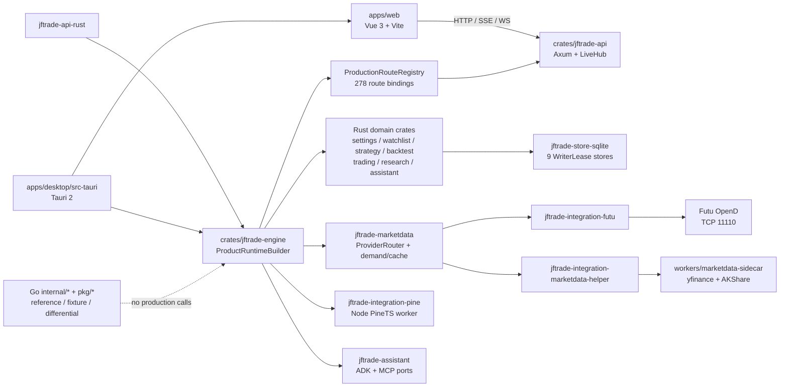

# 当前系统架构

本文面向需要改代码的维护者，说明三件事：

- 系统现在由哪些组件组成
- 请求和实时数据分别走哪条链路
- 后续开发该从哪个边界进入，避免把前端、后端服务和底层 bbgo 公共包混在一起

协议细节、K 线边界和排障案例分别下沉到专题文档。

> 迁移状态（2026-08-27）：当前生产 composition root 是 Rust/Tauri。`jftrade-engine` 承接全部 278 条 `/api/v1/*` 生产路由和 SQLite 权威写入；Tauri 桌面壳管理受管 runtime。Go/Wails 生产入口已下线，历史 Go 实现仅作 reference、fixture 和差分验证保留。`route-ownership.json` 当前把 278 个 operation 登记为 `cutover-qualified`/`productionOwner=rust`/`goRemovalStatus=removed`；Stage 9 closeout 仍是 `in_progress`，平台发布、签名 updater、安全审查、SBOM、回退、备份恢复和 post-release smoke 门禁未关闭。运行入口、端口和数据目录以根目录 [README.md](../README.md) 为准。

## 一句话概括

JFTrade 当前以一个本地 Rust 后端服务为核心。它可以由 `cargo run -p jftrade-engine --bin jftrade-api-rust` 独立启动，也可以由 Tauri 壳 `apps/desktop/src-tauri` 作为受管 API 运行时启动。文中引用 `cmd/jftrade-api` 或 Wails 的段落属于迁移期参照语境。

- 前端控制台只消费 `/api/v1/*`；浏览器模式经过 Rust session auth，桌面模式通过 Tauri IPC 注入 loopback URL 和临时 Bearer token。
- Tauri 桌面壳不替换业务 transport：Vue 仍直接访问 REST、SSE 和 WebSocket；Tauri IPC 仅注入 desktop runtime config，API 语义由 Rust engine 提供。
- Rust production runtime 自主管理策略执行、回测、行情和通知；保留的 Go reference 仍复用 bbgo 公共类型与实现，但不在 Rust/Tauri 生产进程内运行。

历史上的 `pkg/jftradeapi` 兼容门面已经删除。旧文档或旧测试命令如果仍指向 `pkg/jftradeapi`，应迁移到 `crates/jftrade-engine`、`crates/jftrade-api` 或对应业务 crate；Go `internal/app/apiserver` 仅是 reference/differential harness。

## 组件关系


```mermaid
flowchart LR
    CLI[jftrade-api-rust] --> App[crates/jftrade-engine\nProductRuntimeBuilder]
    Desktop[apps/desktop/src-tauri\nTauri 2] --> App
    Desktop --> Web
    Web[apps/web\nVue 3 + Vite] -->|HTTP / SSE / WS| API[crates/jftrade-api\nAxum + LiveHub]
    App --> Registry[ProductionRouteRegistry\n278 route bindings]
    Registry --> API
    App --> Domains[Rust domain crates\nsettings / watchlist / strategy / backtest\ntrading / research / assistant]
    Domains --> Stores[jftrade-store-sqlite\n9 WriterLease stores]
    App --> MarketData[jftrade-marketdata\nProviderRouter + demand/cache]
    MarketData --> FutuIntegration[jftrade-integration-futu]
    FutuIntegration --> OpenD[Futu OpenD\nTCP 11110]
    MarketData --> HelperIntegration[jftrade-integration-marketdata-helper]
    HelperIntegration --> Sidecar[workers/marketdata-sidecar\nyfinance + AKShare]
    App --> Pine[jftrade-integration-pine\nNode PineTS worker]
    App --> Assistant[jftrade-assistant\nADK + MCP ports]

    GoRef[Go internal/* + pkg/*\nreference / fixture / differential] -. no production calls .-> App
```

## 运行模式

`jftrade-api-rust` 是独立 API 入口；`apps/desktop/src-tauri` 是 Tauri 2 产品入口。两者复用 Rust product composition，不形成第二套业务 API。`cmd/jftrade-api` 和 `internal/app/apiserver` 仅保留为 Go reference/differential harness，不是生产或默认开发入口。

| 模式           | 入口                       | 主要用途                                         | 核心组件                                                                                      |
| -------------- | -------------------------- | ------------------------------------------------ | --------------------------------------------------------------------------------------------- |
| 独立 Rust API | `cargo run -p jftrade-engine --bin jftrade-api-rust` | 浏览器前端开发、配置调试和 API 诊断 | `jftrade-api-rust` -> Rust product composition -> `crates/jftrade-api` -> domain crates；默认 `127.0.0.1:3000` |
| Tauri 桌面开发 | `pnpm run dev:desktop` | 桌面联调，同时保留仓库开发数据 | Tauri -> Vite -> 受管 Rust API `3008`；Pine/market-data runtime 由 Tauri 资产配置管理 |
| Tauri 正式产品 | `pnpm run build:desktop` | 独立安装的桌面产品 | `JFTrade` -> embedded frontend -> 受管 Rust API `6699`；按需管理内置行情 helper；可选 Web 默认 `6688` |

当前默认按下面理解：

- 前端、控制台、策略运行控制和交易链路都先经过 JFTrade API 后端服务。
- Tauri sidecar 与可选 Web 入口是两个监听器，但复用同一个 Rust API、服务层和数据目录；sidecar 始终只监听 loopback，不能被 Web 密码当作浏览器入口。
- JFTrade 控制台只承诺 `/api/v1/*`；不要把它和 bbgo 原生 `/api/*` 混为一谈。
- `pkg/futu`、`pkg/strategy/pineworker`、`pkg/backtest` 仍可复用 bbgo 公共类型、PineTS worker 边界和回测组件。
- Rust product 与 Tauri 桌面产品从受管 runtime 资产加载当前平台的 PyInstaller `onedir` `marketdata-sidecar`。yfinance 与 AKShare 在同一进程内独立懒加载；Yahoo↔AKShare 切换复用进程，切回 Futu 后停止。bundle 按 SHA-256 原子发布到 `cache/marketdata-sidecar` 并校验复用。
- 正式运行不接受外部手工管理的 Python 行情进程。`JFTRADE_MARKETDATA_SIDECAR` 只可在开发和测试环境指定绝对路径 helper；旧 `JFTRADE_YFINANCE_SIDECAR` 是低优先级兼容别名。

## 核心职责边界

### 1. 进程入口

职责：决定进程以哪种模式启动，并把控制权交给应用装配层。

- `crates/jftrade-engine/src/bin/jftrade-api-rust.rs`：独立 Rust API 生产入口。
- `apps/desktop/src-tauri`：Tauri 2 桌面入口，集中解析 profile、运行配置、临时桌面 API 凭证、单实例和窗口生命周期。
- `cmd/jftrade-api`：Go reference/differential harness，仅用于契约生成、fixture 和差分验证。

入口不是业务层，不实现行情、设置、策略或协议逻辑。

### 2. Rust product composition

`crates/jftrade-engine` 是生产 composition root。`ProductRuntimeBuilder` 按配置与 schema 校验、数据库迁移/租约、Provider 和 worker、production ports、route registry、HTTP listener 的顺序装配；后续阶段失败时逆序回滚。`ProductionPortBundle` 持有具体 adapter 或明确的 external-unavailable adapter，内部 adapter 缺失会阻止生产启动。`ProductRuntimeHandle` 统一管理 HTTP/LiveHub、Provider demand、OpenD、helper/Pine worker 和 SQLite lease 的逆序关闭。

`ProductionRouteRegistry` 从真实 port binding 生成 278 条生产 route，并校验 count 和 digest。Provider、OpenD、helper 或模型等外部依赖不可用时保留 route 并返回基线 502/503；这不等于缺失内部实现。

### 3. Rust API transport

`crates/jftrade-api` 提供 `/api/v1/*` 的 Axum HTTP、SSE、WebSocket transport、认证边界和 Rust-owned `LiveHub`。Transport 负责请求/响应 wire、cookie/Bearer/Origin/CSRF 校验和连接生命周期；业务状态通过 `jftrade-engine` 注入的窄 port 读取或变更，不直接拥有 SQLite、OpenD 或 worker。

### 4. Rust 领域与生产 adapter

- `jftrade-settings`、`jftrade-calendar`、`jftrade-datamanagement`：设置、交易日历与数据维护规则。
- `jftrade-marketdata`、`jftrade-broker`、`jftrade-trading`：ProviderRouter、订阅 demand/cache、broker 与 execution 规则。
- `jftrade-strategy`、`jftrade-backtest`、`jftrade-integration-pine`：策略状态、撮合和 PineTS worker 边界。
- `jftrade-assistant`、`jftrade-research`、`jftrade-watchlist`：Assistant 领域、研究与自选规则。
- `jftrade-store-sqlite`、`jftrade-store-settings-file`：9 个 SQLite 数据库和 settings 文件的生产持久化与唯一 writer lease。

Go `internal/api/*`、`internal/app/apiserver/*`、`internal/{system,settings,marketdata,...}` 和对应 store/integration 仍用于 OpenAPI 生成、fixture 与 Go/Rust differential；它们不在 Rust/Tauri 生产调用链中。

### 5. Rust integration 与保留的 Go reference

`crates/jftrade-integration-futu` 是 Rust API 使用的 Futu/OpenD 适配层，负责 client 生命周期、exchange 创建、stream/query 调用、探测和协议到 broker-neutral DTO/事件的转换。`crates/jftrade-integration-marketdata-helper` 是轮询型 HTTP Provider，只接收由 Rust product 注入的内部 loopback endpoint，并转换同一套 broker-neutral DTO；它不拥有数据源选择、缓存、订阅或进程生命周期。Go `internal/integration/*` 仅用于 reference/differential harness。

`workers/marketdata-sidecar` 用 FastAPI 封装 Python yfinance 与 AKShare，通过 PyInstaller 打成 `onedir` helper，并由 Rust product runtime 按平台加载、校验 SHA-256 和管理内容寻址缓存。`/healthz` 不导入数据栈；两个 Provider 各自懒加载并独立报告健康，数据路由在 `warming` 时返回带 `Retry-After` 的 503。AKShare 阻塞调用由四槽线程池约束并设 12 秒请求截止。JFTrade 只在需要时启动 helper，Yahoo↔AKShare 切换复用进程，应用关闭或切回 Futu 时停止。它承诺四市场搜索、详情、延迟快照和品种级历史周期（含按 Provider 能力受限的复权日线），并提供新闻、公司行动和 AKShare 沪深指数成分股（成分股仅供 assistant 工具 `market.index_constituents`，无公开 HTTP API）；不提供推流、深度、扩展时段或交易能力。详细契约见 [market-data-providers.md](market-data-providers.md)。

生产持久化位于 `jftrade-store-sqlite` 与 `jftrade-store-settings-file`，由 `jftrade-engine` composition 持有唯一 writer lease。Go `internal/store/*` 和 `internal/datamanagement` 只保留为 schema oracle、fixture 与 differential reference。

`pkg/futu` 仍是 Go reference adapter，保留 bbgo `types.Exchange` 兼容面以供 reference/differential harness 使用；Rust 生产 API 使用 `crates/jftrade-integration-futu`。`pkg/strategy`、`pkg/backtest`、`pkg/broker`、`pkg/market` 等被保留的包承担稳定共享类型或被其他公开包暴露；仓库专属 ADK 引擎已内移至 `internal/assistant/engine`。具体判定和破坏性变更规则见 [public-package-policy.md](architecture/public-package-policy.md)。

### 6. 桌面专属边界

`apps/desktop/src-tauri` 通过 Tauri IPC 注入桌面 runtime 配置、启动状态和临时 API 凭证；Vue 业务请求仍走 Rust API 的 HTTP/SSE/WebSocket。启动页在 API ready 后才挂载主界面；失败页只允许打开日志目录或退出，不做进程内重试。窗口位置、尺寸和最大化状态写入正式产品数据目录的 `desktop-state.json`；开发版与产品版使用不同 Product/SingleInstance ID，允许同时运行。

## 请求与数据流

### 设置与系统状态

```text
apps/web
  -> /api/v1/settings/* 或 /api/v1/system/*
  -> crates/jftrade-api（认证、wire、错误映射）
  -> crates/jftrade-engine production settings/system ports
  -> jftrade-settings / jftrade-store-settings-file / runtime status ports
```

`/api/v1/system/status` 现在同时返回基础状态和轻量观测摘要，包括 API uptime、实时连接统计、行情 collector 状态、broker descriptor 与 strategy runtime summary。

新安装且没有明确选择时，`activeMarketDataProvider` 默认为 `akshare`；明确的 `futu`、`yfinance` 或 `akshare` 选择会保留。显式切换必须通过对应 Provider 的 `ready` 健康门禁，失败时保持原 Provider；启动恢复可在 `warming` 状态提交 Python Provider，从而不阻塞 API。helper 缺失、进程启动或健康端点失败时保留已配置的 Python Provider，并以不可用健康状态报告，绝不隐式回退或持久化为 `futu`。

### 策略设计与运行控制

```text
apps/web
  -> /api/v1/strategy-definitions/* 或 /api/v1/strategies/*
  -> crates/jftrade-api
  -> crates/jftrade-engine production strategy ports
  -> jftrade-strategy + jftrade-store-sqlite
  -> jftrade-integration-pine -> PineTS worker
```

策略定义同时保存 Pine 源码和可选 `visualModel`。前端生成 Pine，Rust engine 统一解析、规划并交给 PineTS worker 执行；Rust 负责调度、回测撮合、风控和订单边界。Go 实现仅用于 reference/differential 验证。

### 实时行情链路

```text
apps/web
  -> SSE /api/v1/stream/live 或 WS /api/v1/ws/live
  -> crates/jftrade-api LiveHub
  -> jftrade-marketdata ProviderRouter + DemandBook + cache
  -> jftrade-engine market-data runtime
     -> jftrade-integration-futu -> Futu OpenD
     -> jftrade-integration-marketdata-helper -> embedded PyInstaller helper -> yfinance / AKShare
```

`jftrade-marketdata` 拥有逻辑 demand、cache、freshness、fallback polling 与 Provider 状态；`jftrade-engine` 组合唯一 `ProviderRouter`、OpenD session/coordinator、helper 和 LiveHub bridge。Provider 切换先验证并原子更新 active state；配置或持久化失败保持旧值并 fail closed。Futu 支持 push 时优先流式更新，yfinance/AKShare 只走轮询；WebSocket 断开会释放对应 demand。策略 runtime 通过 Rust market-data、broker 和 trading ports 消费行情、账户与订单能力，不直接拥有 Provider 或连接。

### 回测历史数据链路

```text
apps/web -> /api/v1/backtests/*
  -> crates/jftrade-api
  -> crates/jftrade-engine backtest ports + sync task registry
  -> jftrade-backtest + jftrade-store-sqlite
  -> ProviderRouter/helper/OpenD ports -> Futu / yfinance / AKShare
```

回测 Provider 设置独立于全局行情设置，首次升级复制全局值，之后独立变化。同步器统一负责倒序分页、范围裁剪、去重、重试和取消；缓存表键含 provider、symbol、interval、adjustment、session。运行接受时固定 Provider，并以中立 `InstrumentSpec` 和 `backtest` session 完成本地撮合，不构造 Futu Exchange。`backtest.db` v2 被识别为 incompatible 并走统一备份重建流程；`backtest-runs.db` 保持独立且不重建。

### K 线、快照与盘口深度

```text
apps/web
  -> /api/v1/market-data/*
  -> crates/jftrade-api
  -> crates/jftrade-engine production market-data ports
  -> jftrade-marketdata ProviderRouter/cache
     -> jftrade-integration-futu -> Futu OpenD
     -> jftrade-integration-marketdata-helper -> embedded PyInstaller helper -> yfinance / AKShare
```

K 线的 bucket 归一、未收盘桶补齐、tick 驱动实时叠加详见 [frontend-kline.md](frontend-kline.md)。yfinance 当前承诺 `US`、`HK`、`SH`、`SZ`；上游数据延迟取决于市场和地区，美股通常约 15 分钟，而应用轮询刷新间隔为 15 秒。它不支持实时推流和 Level 2；这些差异通过 Provider descriptor 暴露，而不是由前端猜测。

### 自选与券商导入

```text
apps/web
  -> /api/v1/watchlist/*
  -> crates/jftrade-api
  -> crates/jftrade-engine production watchlist ports
  -> jftrade-watchlist + jftrade-store-sqlite -> watchlists.db
  -> remote-source / batch-snapshot ports -> ProviderRouter / OpenD
```

`watchlists.db` 是唯一主数据。Futu 3213/3222 只承担远端分组发现与预览导入，3203 `SecuritySnapshot` 只承担可见行报价；自选行情不进入实时 collector demand 或 BasicQot 订阅。完整边界见 [watchlist.md](watchlist.md)。

### Assistant/ADK

```text
apps/web
  -> /api/v1/adk/* JSON/SSE
  -> crates/jftrade-api
  -> crates/jftrade-engine ADK read/mutation/chat-stream ports
  -> jftrade-assistant + ADK/session/artifact SQLite stores
  -> configured model provider / MCP listener
```

HTTP transport 不依赖 Futu、protobuf 或具体模型实现。`jftrade-engine` 组合 ADK store/session/artifact、工具 executor、workflow/task/approval runtime、chat stream 和 MCP listener；`jftrade-assistant` 保持领域规则与 transport、SQLite 和 integration 解耦。模型 Provider 未配置或不可用时，chat 与 stream 路由返回明确 503，不生成伪成功结果。Go Assistant 实现只用于 reference/differential。

### 通知链路

```text
Futu OpenD push / Rust business event
  -> jftrade-integration-futu broker-neutral event
  -> jftrade-engine live/assistant/notification ports
  -> crates/jftrade-api LiveHub
  -> /api/v1/stream/live 或 /api/v1/ws/live
  -> apps/web Notification Center
```

## 当前约束与设计取舍

### Go reference 的 bbgo 公共能力仍然保留

- `pkg/futu` 实现 bbgo `types.Exchange` 等公开接口。
- PineTS worker 通过 Rust 的 `jftrade-integration-pine` 接入策略执行边界；Go `pkg/strategy/pineworker` 仅保留 reference/differential harness。
- `pkg/backtest` 的 Go 实现仅供 reference/differential 对照；生产撮合、资金曲线和指标统计由 Rust engine 负责。
- 不支持的交易所能力通过 `ErrNotSupported` 明确暴露。

### sidecar 与 bbgo server 不等价

维护文档和实现时必须区分：

- JFTrade 控制台主要使用 `/api/v1/*`
- bbgo 原生 server 的 `/api/*` 不是 JFTrade 当前运行模式的一部分

任何需求如果直接假设“前端应改去接 bbgo 原生接口”，都需要先重新审查是否破坏现有控制台契约。

### Futu 适配层只服务需要 OpenD 的边界

生产 Futu 行情、交易和实时策略适配位于 `jftrade-integration-futu`；Go `pkg/futu` 只保留公开兼容面和 reference/differential。回测历史同步经通用 Provider 端口，回测撮合不依赖 Futu Exchange。改这里时必须先判断是：

- 改 sidecar 行情/连接行为
- 改实时策略执行依赖的 exchange 行为
- 还是同时影响多个调用方

## 后续开发入口

1. 改独立 API 启动方式、运行模式、环境变量：先看 [`jftrade-api-rust`](../crates/jftrade-engine/src/bin/jftrade-api-rust.rs)、[../crates/jftrade-engine](../crates/jftrade-engine) 和 [../crates/jftrade-api](../crates/jftrade-api)。Go `cmd/jftrade-api` 仅用于 reference/differential harness。
2. 改桌面 profile、菜单、Tauri IPC、窗口状态或更新：先看 [../apps/desktop/src-tauri](../apps/desktop/src-tauri) 和 [troubleshooting/desktop-release.md](troubleshooting/desktop-release.md)。
3. 改前端 API、系统状态、设置：先看 [../crates/jftrade-api](../crates/jftrade-api)、[../crates/jftrade-engine](../crates/jftrade-engine)、[../crates/jftrade-settings](../crates/jftrade-settings) 和 [../crates/jftrade-store-settings-file](../crates/jftrade-store-settings-file)。
4. 改策略定义、Pine/结构指令同步：先看 [../crates/jftrade-strategy](../crates/jftrade-strategy)、[../crates/jftrade-integration-pine](../crates/jftrade-integration-pine)、`crates/jftrade-engine` 的 strategy production ports、[../apps/web/src/pages/StrategyDesignPage.vue](../apps/web/src/pages/StrategyDesignPage.vue) 和 [../apps/web/src/features/pine-structure/index.ts](../apps/web/src/features/pine-structure/index.ts)。
5. 改行情 Provider、订阅、实时推送或通知：先看 [../crates/jftrade-marketdata](../crates/jftrade-marketdata)、[../crates/jftrade-integration-futu](../crates/jftrade-integration-futu)、[../crates/jftrade-integration-marketdata-helper](../crates/jftrade-integration-marketdata-helper)、[../crates/jftrade-api](../crates/jftrade-api) 的 `LiveHub` 和 `crates/jftrade-engine` 的 production ports/composition。
6. 改 Futu 协议、映射、连接：先看 [../crates/jftrade-integration-futu](../crates/jftrade-integration-futu)；[../pkg/futu/exchange.go](../pkg/futu/exchange.go) 只作为公开兼容/reference 对照。
7. 改实时 K 线：先看 [frontend-kline.md](frontend-kline.md)。
8. 改 Assistant/ADK/MCP：先看 [../crates/jftrade-assistant](../crates/jftrade-assistant)、[../crates/jftrade-engine](../crates/jftrade-engine) 的 ADK/MCP ports 与 [../crates/jftrade-store-sqlite](../crates/jftrade-store-sqlite) 的 ADK stores。
9. 改自选领域、券商导入、星标或自选快照：先看 [watchlist.md](watchlist.md)、[../crates/jftrade-watchlist](../crates/jftrade-watchlist)、[../crates/jftrade-store-sqlite](../crates/jftrade-store-sqlite) 与 `crates/jftrade-engine` 的 watchlist production ports。

## 相关文档

- [README.md](README.md)：docs 阅读入口
- [architecture/backend-coding-standards.md](architecture/backend-coding-standards.md)：后端分层代码规范
- [roadmap.md](roadmap.md)：当前仍需推进的 ownership 与扩展性工作
- [troubleshooting.md](troubleshooting.md)：排障入口
- [frontend/strategy-authoring.md](frontend/strategy-authoring.md)：前端策略设计专题
- [frontend-kline.md](frontend-kline.md)：前端行情与 K 线专题入口
- [market-data-providers.md](market-data-providers.md)：Futu/yfinance 能力、配置和 sidecar 边界
- [watchlist.md](watchlist.md)：自选、导入、行情与 ADK 专题
- [reference/README.md](reference/README.md)：协议与参考资料入口
