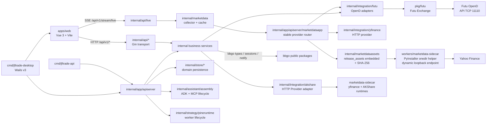

# 当前系统架构

本文面向需要改代码的维护者，说明三件事：

- 系统现在由哪些组件组成
- 请求和实时数据分别走哪条链路
- 后续开发该从哪个边界进入，避免把前端、后端服务和底层 bbgo 公共包混在一起

协议细节、K 线边界和排障案例分别下沉到专题文档。

## 一句话概括

JFTrade 当前以一个本地后端服务为核心。它既可以由 `cmd/jftrade-api` 独立启动，也可以由 Wails `cmd/jftrade-desktop` 作为桌面 sidecar 管理。下文仍用 sidecar 指这个后端服务。

- 前端控制台使用 JFTrade 后端服务，`cmd/jftrade-api` 和 `cmd/jftrade-desktop` 都装配到 `internal/app/apiserver`；HTTP 层位于 `internal/api/*`，业务能力位于 `internal/{system,settings,marketdata,trading,strategy,backtest,assistant,watchlist}`。
- Wails 桌面壳不替换业务 transport：Vue 仍直接访问 REST、SSE 和 WebSocket；bindings 仅承载启动状态、链接、桌面日志和更新检查。
- 策略执行、回测、行情和通知仍复用 bbgo 的公共类型、stream、backtest engine 和通知总线，但不再提供独立 bbgo CLI/full runtime 入口。

历史上的 `pkg/jftradeapi` 兼容门面已经删除。旧文档或旧测试命令如果仍指向 `pkg/jftradeapi`，应迁移到 `internal/app/apiserver/servercore`、`internal/api/*` 或对应业务 service。

## 组件关系


```mermaid
flowchart LR
    Web[apps/web\nVue 3 + Vite] -->|HTTP /api/v1/*| API[internal/api/*\nGin transport]
    Web -->|SSE /api/v1/stream/live| LiveAPI[internal/api/live]
    API --> Services[internal business services]
    LiveAPI --> MarketData[internal/marketdata\ncollector + cache]
    MarketData --> MarketDataRuntime[internal/app/apiserver/marketdataapp\nstable provider router]
    MarketDataRuntime --> FutuIntegration
    MarketDataRuntime --> YFinanceIntegration[internal/integration/yfinance\nHTTP provider]
    MarketDataRuntime --> YFinanceAssets[internal/marketdataassets\nrelease_assets embedded + SHA-256]
    YFinanceAssets --> YFinanceSidecar[workers/marketdata-sidecar\nPyInstaller onedir helper\ndynamic loopback endpoint]
    YFinanceSidecar --> Yahoo[Yahoo Finance]
    App --> Services
    App --> Stores[internal/store/*\ndomain persistence]
    App --> AssistantAssembly[internal/assistant/assembly\nADK + MCP lifecycle]
    App --> PineRuntime[internal/strategy/pineruntime\nworker lifecycle]
    Services --> FutuIntegration[internal/integration/futu\nOpenD adapters]
    Services --> AKShareIntegration[internal/integration/akshare\nHTTP Provider adapter]
    AKShareIntegration --> MarketDataSidecar[marketdata-sidecar\nyfinance + AKShare runtimes]
    FutuIntegration --> Futu[pkg/futu\nFutu Exchange]
    Futu --> OpenD[Futu OpenD\nAPI TCP 11110]

    CLI[cmd/jftrade-api] --> App[internal/app/apiserver]
    Desktop[cmd/jftrade-desktop\nWails v3] --> App
    Desktop --> Web
    Services -->|bbgo types / sessions / notify| BBGOPrimitives[bbgo public packages]
```

## 运行模式

`cmd/jftrade-api` 是独立 API 入口；`cmd/jftrade-desktop` 是 Wails v3 产品入口。两者复用 `internal/app/apiserver`，不会形成第二套业务 API。

| 模式           | 入口                       | 主要用途                                         | 核心组件                                                                                      |
| -------------- | -------------------------- | ------------------------------------------------ | --------------------------------------------------------------------------------------------- |
| API 后端服务   | `go run ./cmd/jftrade-api` | 前端开发、配置调试、行情、策略运行控制与通知调试 | `cmd/jftrade-api` -> `internal/app/apiserver` -> `internal/api/*` -> services -> integrations |
| Wails 桌面开发 | `pnpm run desktop:dev`      | 桌面联调，同时保留仓库开发数据                   | `JFTrade Dev` -> Vite -> loopback sidecar `3008`；可选 Web 监听器使用用户端口                  |
| Wails 正式产品 | `release_assets` 构建      | 独立安装的桌面产品                               | `JFTrade` -> embedded frontend -> loopback API sidecar `6699`；按需自动管理内置行情 helper；可选 Web 默认 `6688` |

当前默认按下面理解：

- 前端、控制台、策略运行控制和交易链路都先经过 JFTrade API 后端服务。
- Wails sidecar 与可选 Web 入口是两个监听器，但复用同一个 Gin handler、服务层和数据目录；sidecar 始终只监听 loopback，不能被 Web 密码当作浏览器入口。
- JFTrade 控制台只承诺 `/api/v1/*`；不要把它和 bbgo 原生 `/api/*` 混为一谈。
- `pkg/futu`、`pkg/strategy/pineworker`、`pkg/backtest` 仍可复用 bbgo 公共类型、PineTS worker 边界和回测组件。
- `cmd/jftrade-api` 和桌面产品都从 `release_assets` 嵌入当前平台的 PyInstaller `onedir` `marketdata-sidecar`（`darwin/arm64`、`linux/amd64`、`windows/amd64`、`windows/arm64`）。yfinance 与 AKShare 在同一进程内独立懒加载；Yahoo↔AKShare 切换复用进程，切回 Futu 后停止。bundle 按 SHA-256 原子发布到 `cache/marketdata-sidecar` 并校验复用。
- 正式运行不接受外部手工管理的 Python 行情进程。`JFTRADE_MARKETDATA_SIDECAR` 只可在开发和测试环境指定绝对路径 helper；旧 `JFTRADE_YFINANCE_SIDECAR` 是低优先级兼容别名。

## 核心职责边界

### 1. 进程入口

职责：决定进程以哪种模式启动，并把控制权交给应用装配层。

- `cmd/jftrade-api`：独立 API 后端服务入口。
- `cmd/jftrade-desktop`：Wails v3 桌面入口，集中解析 build profile、运行配置、临时桌面 API 凭证、单实例和窗口生命周期；窗口先进入 Wails `Run`，`ApplicationStarted` 后才异步装配 API，并通过 `DesktopStartupService` 暴露 `starting/ready/failed`。
- 历史 full 模式入口已移除。

入口不是业务层，不实现行情、设置、策略或协议逻辑。

### 2. `internal/app/apiserver`

职责：API sidecar 的启动、依赖装配、运行时目录、配置落地和关闭顺序。

- `lifecycle`：API sidecar 生命周期。
- `runtime`：运行时路径、环境变量和 OpenD 配置注入。
- `application`：按成功启动顺序登记资源，启动中途失败时逆序回滚；关闭可重复、并发安全，并聚合带资源名的错误。
- `stores`：持久化 store 的单一应用句柄；保持降级启动语义，并在句柄内部按打开顺序逆序关闭。
- `runtimes`：应用 runtime 的单一句柄；按生命周期分组引用，线性化 Pine runner 切换，并在句柄内部按成功登记顺序逆序关闭。
- `futuapp`：Futu broker 选择、reset 顺序和控制台投影；OpenD 协议与连接实现仍归 `internal/integration/futu`。
- `marketdataapp`：在稳定的 `internal/marketdata.Service` 下原子切换 Futu/yfinance/AKShare Provider，撤销旧 Provider demand 并按 broker 保留规则回收物理订阅，同时管理内置 PyInstaller helper 的持久缓存/临时降级、动态 loopback 端口、预热 readiness、停止和过期清理。
- `servercore`：HTTP/security/frontend shell 与兼容入口；业务路由直接注册 `internal/api/*` handler，领域状态和生命周期由应用依赖入口持有。

运行时按生命周期明确分成三类：

| 类别 | 运行时 | 设置变更与关闭规则 |
| --- | --- | --- |
| 启动根 | 通知 publisher、broker registry、exchange calendar manager、实盘控制面 | 应用启动时建立；为后续可缺省 runtime 提供稳定依赖 |
| 可缺省/延后装配 | Live WebSocket、策略 runtime manager、Assistant assembly | 允许降级启动或窄测试装配；存在时由 `runtimes.Handle` 统一登记和关闭 |
| 可重置 | market-data Provider router/Futu coordinator/Python helper、Pine worker manager 与 runner | 只响应本领域设置；Provider 切换清缓存并撤销旧 demand，受 broker 保留规则约束的物理订阅由 collector 后台回收；helper 在任一 Python Provider 活跃期间复用，新 runner 发布后释放旧 runner |

应用资源先停 trading updates、market-data/backtest service，再关闭 runtime handle，最后关闭 stores；runtime handle 内部继续按实际成功登记的反序关闭 Assistant、实时入口、策略 runtime、Pine/Futu 与启动根。所有关闭错误保留资源名并聚合返回。

### 3. `internal/api/*`

职责：提供 `/api/v1/*` 的 HTTP/SSE/WebSocket transport。

Handler 只做参数绑定、校验、调用 service、错误映射和响应转换。它们不直接访问 SQLite、Futu protobuf、OpenD client 或具体集成实现。

### 4. 业务 service

职责：承载控制台业务能力。

- `internal/system`：系统状态、OpenD 诊断、存储概览、风控状态。
- `internal/settings`：设置读写、归一化和 side-effect 触发点。
- `internal/marketdata`：订阅、tick cache、collector、快照/K 线/depth 门面。
- `internal/trading`：broker 读写、execution 命令和订单更新编排。
- `internal/strategy`：策略定义、实例目录、插件目录和 runtime 控制面。
- `internal/backtest`：回测运行、同步任务和历史数据同步门面。
- `internal/assistant`：ADK session、run、approval、provider、agent、skill、metrics。
- `internal/watchlist`：本地多分组自选、membership revision、券商导入一致性和批量快照编排。

业务 service 通过小接口依赖外部能力，不反向 import `internal/api/*`。

### 5. `internal/integration/*` 与 `pkg/*`

`internal/integration/futu` 是 API sidecar 内部使用的 Futu/OpenD 适配层，负责 client 生命周期、exchange 创建、stream/query 调用、探测和协议到 broker-neutral DTO/事件的转换。`internal/integration/yfinance` 是轮询型 HTTP Provider，只接收由 `marketdataapp` 注入的内部 loopback endpoint，并转换同一套 broker-neutral DTO；它不拥有数据源选择、缓存、订阅或进程生命周期。

`workers/marketdata-sidecar` 用 FastAPI 封装 Python yfinance 与 AKShare，通过 PyInstaller 打成 `onedir` helper，并由 `internal/marketdataassets` 按平台嵌入、校验 SHA-256 和管理内容寻址缓存。`/healthz` 不导入数据栈；两个 Provider 各自懒加载并独立报告健康，数据路由在 `warming` 时返回带 `Retry-After` 的 503。AKShare 阻塞调用由四槽线程池约束并设 12 秒请求截止。JFTrade 只在需要时启动 helper，Yahoo↔AKShare 切换复用进程，应用关闭或切回 Futu 时停止。它承诺四市场搜索、详情、延迟快照和品种级历史周期，不提供推流、深度、扩展时段或交易能力。详细契约见 [market-data-providers.md](market-data-providers.md)。

持久化按领域位于 `internal/store/{strategy,backtest,trading,watchlist,research,...}`。数据维护只通过 `internal/datamanagement` 的 busy、purge、compact 窄端口访问这些资源，不读取 store 的锁、map 或数据库连接。

`pkg/futu` 仍是 Futu exchange adapter，保留 bbgo `types.Exchange` 兼容面以服务 Futu 行情和实时策略的应用适配层；通用历史同步和回测运行不再引用它。`pkg/strategy`、`pkg/backtest`、`pkg/broker`、`pkg/market` 等被保留的包承担稳定共享类型或被其他公开包暴露；仓库专属 ADK 引擎已内移至 `internal/assistant/engine`。具体判定和破坏性变更规则见 [public-package-policy.md](architecture/public-package-policy.md)。

### 6. 桌面专属边界

`cmd/jftrade-desktop` 只暴露四个 bindings 服务：启动状态、外部链接、分页桌面日志和更新检查。生成的 TypeScript bindings 位于 `apps/web/src/wails`。启动页通过本地 binding 轮询状态，API ready 后才挂载主界面；失败页只允许打开日志目录或退出，不做进程内重试。窗口位置、尺寸和最大化状态写入正式产品数据目录的 `desktop-state.json`；开发版与产品版使用不同 Product/SingleInstance ID，允许同时运行。

## 请求与数据流

### 设置与系统状态

```text
apps/web
  -> /api/v1/settings/* 或 /api/v1/system/*
  -> internal/api/settings 或 internal/api/system
  -> internal/settings.Service 或 internal/system.Service
  -> internal/app/apiserver 装配的 service ports
```

`/api/v1/system/status` 现在同时返回基础状态和轻量观测摘要，包括 API uptime、实时连接统计、行情 collector 状态、broker descriptor 与 strategy runtime summary。

新安装且没有明确选择时，`activeMarketDataProvider` 默认为 `yfinance`；明确的 `futu`、`yfinance` 或 `akshare` 选择会保留。显式切换必须通过对应 Provider 的 `ready` 健康门禁，失败时保持原 Provider；启动恢复可在 `warming` 状态提交 Python Provider，从而不阻塞 API。helper 缺失、进程启动或健康端点失败时回退并持久化 `futu`，确保配置与运行态一致。

### 策略设计与运行控制

```text
apps/web
  -> /api/v1/strategy-definitions/* 或 /api/v1/strategies/*
  -> internal/api/strategy
  -> internal/strategy.Service
  -> internal/store/strategy + strategy catalog/runtime ports
  -> internal/strategy/pineruntime
  -> pkg/strategy Pine parser / spec / PineTS worker runtime
```

策略定义同时保存 Pine 源码和可选 `visualModel`。前端生成 Pine，后端统一解析、规划并交给 PineTS worker 执行；Go 侧保留调度、回测撮合、风控和订单边界。

### 实时行情链路

```text
apps/web
  -> SSE /api/v1/stream/live 或 WS /api/v1/ws/live
  -> internal/api/live
  -> internal/marketdata.Service collector + cache + active-demand merge
  -> internal/app/apiserver/marketdataapp.Runtime
     -> Futu: NewStream() / QueryTickers() -> Futu OpenD
     -> yfinance: QueryTickers() polling -> embedded PyInstaller helper (dynamic loopback) -> Yahoo Finance
```

`internal/marketdata` 拥有 demand、cache、freshness、fallback polling、backoff、health/reset/close。`marketdataapp.Runtime` 同时是应用级 Provider 实例池：全局行情和回测分别持有租约，逻辑切换只替换 active 引用，不会使已接受任务失效；共享 Python helper 在最后一个 Python Provider 租约释放后才停止。显式切到 yfinance 会先启动内置 helper 并等待 `ready` 健康门禁，失败则保持当前 Provider 并由设置 API 返回冲突。逻辑切换成功后不会再被旧 Futu 清理失败回滚：OpenD 要求物理订阅至少保留一分钟，collector 会在非活跃 Futu demand 归零后延迟退订并重试。Futu 支持 push 时优先流式更新，yfinance/AKShare 只走轮询。策略 runtime 分别消费实时市场源、账户查询和交易命令端口：live 与 notify-only 均要求 `streamingCandles=true`，首期只有 Futu 可启动；notify-only 不解析账户，live 才按实例绑定的 `brokerId` 精确解析可交易 broker，订单命令统一经过 `internal/trading`。

### 回测历史数据链路

```text
apps/web -> /api/v1/backtests/*
  -> internal/backtest HistoricalCandleSource
  -> internal/app/apiserver/backtestapp
  -> marketdataapp Provider lease -> Futu / yfinance / AKShare
  -> pkg/backtest KLineStore schema v3
```

回测 Provider 设置独立于全局行情设置，首次升级复制全局值，之后独立变化。同步器统一负责倒序分页、范围裁剪、去重、重试和取消；缓存表键含 provider、symbol、interval、adjustment、session。运行接受时固定 Provider，并以中立 `InstrumentSpec` 和 `backtest` session 完成本地撮合，不构造 Futu Exchange。`backtest.db` v2 被识别为 incompatible 并走统一备份重建流程；`backtest-runs.db` 保持独立且不重建。

### K 线、快照与盘口深度

```text
apps/web
  -> /api/v1/market-data/*
  -> internal/api/marketdata
  -> internal/marketdata.Service
  -> internal/app/apiserver/marketdataapp.Runtime
     -> internal/integration/futu / pkg/futu -> Futu OpenD
     -> internal/integration/yfinance -> embedded PyInstaller helper (dynamic loopback) -> Yahoo Finance
```

K 线的 bucket 归一、未收盘桶补齐、tick 驱动实时叠加详见 [frontend-kline.md](frontend-kline.md)。yfinance 当前承诺 `US`、`HK`、`SH`、`SZ`；上游数据延迟取决于市场和地区，美股通常约 15 分钟，而应用轮询刷新间隔为 15 秒。它不支持实时推流和 Level 2；这些差异通过 Provider descriptor 暴露，而不是由前端猜测。

### 自选与券商导入

```text
apps/web
  -> /api/v1/watchlist/*
  -> internal/api/watchlist
  -> internal/watchlist.Service
  -> internal/store/watchlist -> watchlists.db
  -> WatchlistSourceReader / BatchSnapshotSource
  -> pkg/futu -> Futu OpenD
```

`watchlists.db` 是唯一主数据。Futu 3213/3222 只承担远端分组发现与预览导入，3203 `SecuritySnapshot` 只承担可见行报价；自选行情不进入实时 collector demand 或 BasicQot 订阅。完整边界见 [watchlist.md](watchlist.md)。

### Assistant/ADK

```text
apps/web
  -> /api/v1/adk/* JSON/SSE
  -> internal/api/assistant
  -> internal/assistant.Service
  -> internal/assistant/assembly
  -> internal/assistant/engine runtime（assembly 私有）
```

HTTP transport 不依赖 Futu、protobuf、ADK runtime 或旧 sidecar 门面。`internal/assistant/assembly.Handle` 负责 ADK store/session、工具装配、workflow bridge、MCP listener 和幂等关闭；`ApplicationAdapter` 从各业务 service 形成 Assistant 所需投影，且不得反向依赖 `internal/app`、具体 store 或 integration。应用层只持有 `assistant/assembly.Runtime` 接口。

### 通知链路

```text
Futu OpenD protocol 1003 / bbgo.Notify(...)
  -> internal/integration/futu broker-neutral event
  -> live/assistant business publisher
  -> internal/live ReplayPublisher
  -> /api/v1/stream/live
  -> apps/web Notification Center
```

## 当前约束与设计取舍

### bbgo 公共能力复用仍然成立

- `pkg/futu` 实现 bbgo `types.Exchange` 等公开接口。
- PineTS worker 通过 `pkg/strategy/pineworker` 接入策略执行边界；Go 主进程不再维护自研 Pine 执行 runtime。
- `pkg/backtest` 复用 bbgo backtest engine，并通过 Pine worker 结果进入 Go 撮合、资金曲线和指标统计。
- 不支持的交易所能力通过 `ErrNotSupported` 明确暴露。

### sidecar 与 bbgo server 不等价

维护文档和实现时必须区分：

- JFTrade 控制台主要使用 `/api/v1/*`
- bbgo 原生 server 的 `/api/*` 不是 JFTrade 当前运行模式的一部分

任何需求如果直接假设“前端应改去接 bbgo 原生接口”，都需要先重新审查是否破坏现有控制台契约。

### Futu 适配层只服务需要 OpenD 的边界

`pkg/futu` 服务 Futu 行情、交易和实时策略适配。回测历史同步经通用 Provider 端口，回测撮合不依赖 Futu Exchange。改这里时必须先判断是：

- 改 sidecar 行情/连接行为
- 改实时策略执行依赖的 exchange 行为
- 还是同时影响多个调用方

## 后续开发入口

1. 改独立 API 启动方式、运行模式、环境变量：先看 [../cmd/jftrade-api/main.go](../cmd/jftrade-api/main.go) 和 [../internal/app/apiserver](../internal/app/apiserver)。
2. 改桌面 profile、菜单、bindings、窗口状态或更新：先看 [../cmd/jftrade-desktop](../cmd/jftrade-desktop)、[../internal/desktop](../internal/desktop) 和 [troubleshooting/desktop-release.md](troubleshooting/desktop-release.md)。
3. 改前端 API、系统状态、设置：先看 [../internal/api](../internal/api)、[../internal/system](../internal/system)、[../internal/settings](../internal/settings)。
4. 改策略定义、Pine/结构指令同步：先看 [../internal/api/strategy](../internal/api/strategy)、[../internal/strategy](../internal/strategy)、[../apps/web/src/pages/StrategyDesignPage.vue](../apps/web/src/pages/StrategyDesignPage.vue) 和 [../apps/web/src/features/pine-structure/index.ts](../apps/web/src/features/pine-structure/index.ts)。
5. 改行情 Provider、订阅、实时推送或通知：先看 [../internal/marketdata](../internal/marketdata)、[../internal/app/apiserver/marketdataapp](../internal/app/apiserver/marketdataapp)、[../internal/api/live](../internal/api/live) 和对应的 `internal/integration/{futu,yfinance}`。
6. 改 Futu 协议、映射、连接：先看 [../pkg/futu/exchange.go](../pkg/futu/exchange.go) 与 reference 层文档。
7. 改实时 K 线：先看 [frontend-kline.md](frontend-kline.md)。
8. 改 Assistant/ADK HTTP 契约：先看 [../internal/api/assistant](../internal/api/assistant) 和 [../internal/assistant](../internal/assistant)。
9. 改自选领域、券商导入、星标或自选快照：先看 [watchlist.md](watchlist.md)、[../internal/watchlist](../internal/watchlist) 和 [../internal/api/watchlist](../internal/api/watchlist)。

## 相关文档

- [README.md](README.md)：docs 阅读入口
- [architecture/backend-coding-standards.md](architecture/backend-coding-standards.md)：后端分层代码规范
- [roadmap.md](roadmap.md)：当前仍需推进的 ownership 与扩展性工作
- [troubleshooting.md](troubleshooting.md)：排障入口
- [frontend/strategy-authoring.md](frontend/strategy-authoring.md)：前端策略设计专题
- [frontend-kline.md](frontend-kline.md)：前端行情与 K 线专题入口
- [market-data-providers.md](market-data-providers.md)：Futu/yfinance 能力、配置和 sidecar 边界
- [watchlist.md](watchlist.md)：自选、导入、行情与 ADK 专题
- [reference/README.md](reference/README.md)：协议与参考资料入口
