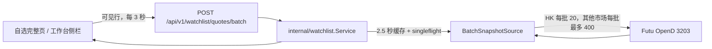
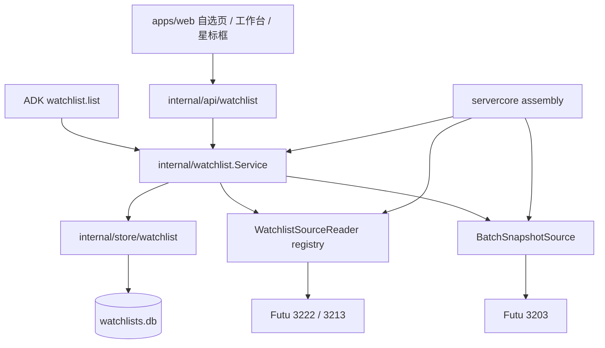

# 自选系统

JFTrade 自选系统以本地数据为主，统一管理跨市场、多分组标的，并允许从券商读取分组后预览导入。当前版本是 Futu-first，但领域模型、HTTP API 和 UI 都按多券商 source 设计。

## 使用入口

### 完整自选页

打开 `/watchlist`：

- 顶部分组标签包含“全部”和所有本地分组；“全部”按 `instrumentId` 去重。
- 支持按名称或代码搜索，并按市场过滤。
- 表格只为当前可见行及少量 overscan 请求行情；滚动到底部时继续加载下一页。
- 点击标的会把它设为工作台当前标的，并跳转到 `/workspace`。
- “创建 / 管理分组”负责本地分组的新增、改名和删除。
- “券商导入”负责远端分组发现、差异预览、提交和绑定管理。

### 工作台自选栏

`/workspace` 左侧默认显示自选栏：

- 桌面宽度可在 220–420 px 之间拖拽，宽度、显隐和当前分组保存在本机视图状态。
- 隐藏后工作台恢复全宽，可通过左上角“自选”按钮重新打开。
- 视口不超过 1180 px 时，自选栏改为覆盖式抽屉；选中标的后自动关闭。
- 侧栏和完整页都只刷新当前可见行行情，页面隐藏或组件离开后暂停轮询。

### 星标收藏

图表标题旁的 `☆/★` 表示当前标的是否属于至少一个本地分组：

1. 点击星标打开分组选择框。
2. 一个标的可以同时选择多个分组。
3. 可以在对话框中输入新分组名并随收藏操作原子创建。
4. 清空全部分组后保存，等价于取消收藏。

保存使用 membership revision 做乐观并发控制。发生 `409` 时，对话框会刷新最新状态并保留在当前页面，用户核对后再次保存。

## 数据主权与术语

`watchlists.db` 是唯一主数据。券商分组是只读导入来源，不是 JFTrade 本地状态的实时镜像。

| 概念 | 含义 |
| --- | --- |
| 本地分组 | JFTrade 拥有的分组。默认“自选股”分组受保护，不能删除。 |
| 标的 | 使用 `pkg/market.ParseInstrument` 规范化后的 canonical ID，例如 `US.AAPL`、`HK.00700`。 |
| Membership | 标的与本地分组的多对多关系；同一标的可以属于多个组。 |
| Source | 一个券商登录连接，不等同于交易账户。Futu 首个稳定 source 是 `futu:default`。 |
| Binding | 一个远端分组与一个本地分组的导入关联，用于下次重复对账。 |
| Preview | 某次导入的差异快照，包含新增、不变和本地独有项。 |
| Import run | 已提交导入的审计记录，保留新增、删除和不变数量。 |

分组名经过 trim 和不区分大小写的唯一性校验。membership 以 `(groupId, instrumentId)` 唯一；券商代码和 security ID 只保存为 alias，不参与标的身份判断。

## 券商导入语义

当前导入流程只读券商，不向券商写回：

1. 发现 source 和远端分组。
2. 选择已有本地组，或指定一个新的本地组名。
3. 生成 preview，展示：
   - 新增：远端存在、本地不存在，提交时自动加入。
   - 不变：远端和本地都存在。
   - 本地独有：本地存在、远端不存在，默认保留；只有显式勾选后才删除。
4. 提交前重新读取远端成员，并同时校验远端 hash、preview 有效期和本地 group revision。
5. 任一侧在预览后发生变化时返回 `409`，要求重新预览。

Preview 默认有效期为 10 分钟。删除 binding、删除本地组或删除本地成员都不会修改券商端。

Futu v1 使用：

- OpenD 3222：读取用户证券分组。
- OpenD 3213：读取指定分组成员。
- 每个 source 的 3213/3222 读取使用本地缓存，并限制为 30 秒内 10 次实际调用。
- system group 和 custom group 都可导入。
- trim/casefold 后同名的远端组会标记为 `ambiguous`，必须先在 Futu 客户端改名。

OpenD 没有分组创建接口，因此所有新分组都创建在 JFTrade。本版本没有接入 3214 `ModifyUserSecurity`。

## 行情边界

自选行情走 broker-neutral `BatchSnapshotSource`，Futu 实现只调用 OpenD 3203 `SecuritySnapshot`：



这条链路不会进入 `internal/marketdata` collector demand，不调用 `GetBasicQot`，也不建立行情订阅。市场数据权限仍由 Futu/OpenD 决定；“不占订阅名额”不等于“绕过行情权限”。

批量失败按标的隔离。某一标的无权限、不支持或没有返回快照时，会进入响应的 `errors[]`，不影响同批其他标的。响应同时携带主时段价格、昨收、涨跌、session、数据时间，以及可用的盘前、盘后和夜盘块。

## 架构



职责边界：

- `internal/api/watchlist`：Gin 参数绑定、响应 envelope 和业务错误到 HTTP 状态映射。
- `internal/watchlist`：分组、membership、导入一致性、行情缓存和 connector port。
- `internal/store/watchlist`：SQLite migration、事务、分页、binding、preview/run 和来源审计。
- `servercore/watchlist_*.go`：生命周期装配、Futu connector 适配和运行状态探测。
- `pkg/futu`：OpenD 3213/3222 protobuf/client wrapper，以及 broker-neutral 分组读取接口实现。
- `apps/web/src/components/domain/watchlist`：通过 props 和 composable 输入数据的领域 UI，不直接裸发 HTTP 请求。

BBGO 继续负责行情、账户、交易和 stream 公共能力。它的实时 `Subscription` 表示订阅需求，不承担 JFTrade 收藏数据。

## 本地存储与运维

数据库默认和 `settings.json` 位于同一运行时目录：

- 开发态和 `JFTrade Dev`：`var/jftrade-api/watchlists.db`
- 正式桌面版：系统用户数据目录中的 `watchlists.db`
- 显式覆盖：`JFTRADE_WATCHLIST_DB=/absolute/path/watchlists.db`

数据库采用独立、有序 migration ledger，并自动确保受保护的默认分组。它已注册为关键 runtime resource；数据库不可用时，`/api/v1/watchlist/*` 返回 `503 WATCHLIST_UNAVAILABLE`，不会退回券商数据充当主库。

在“设置 → 数据管理”可以：

- 查看 watchlist 数据库状态。
- 创建一致性备份。
- 在明确确认后重建数据库。

重建会丢失本地分组、收藏关系、binding 和导入审计；券商端数据不受影响，之后可以重新导入。

## HTTP API

所有接口位于 `/api/v1/watchlist`，完整 schema 以自动生成的 [HTTP API](./reference/generated/api.md) 和 [数据类型](./reference/generated/types.md) 为准。

| 方法 | 路径 | 用途 |
| --- | --- | --- |
| GET / POST | `/groups` | 列出或创建本地分组 |
| PATCH / DELETE | `/groups/{groupId}` | 改名或删除本地分组 |
| GET | `/items` | 按 group、query、market、cursor 和 limit 分页 |
| GET / PUT | `/instruments/{market}/{symbol}/memberships` | 读取或原子替换多分组归属 |
| POST | `/quotes/batch` | 批量读取快照行情，最多 500 个 canonical ID |
| GET | `/sources` | 查看券商 source 状态 |
| GET | `/sources/{sourceId}/groups` | 发现远端分组 |
| GET / DELETE | `/bindings` | 查看或解除远端到本地绑定 |
| POST | `/imports/preview` | 生成导入差异预览 |
| POST | `/imports/{previewId}/commit` | 提交预览，并可选择删除本地独有项 |
| GET | `/import-runs` | 分页读取导入审计 |

常见错误：

| HTTP | 错误码 | 含义 |
| --- | --- | --- |
| 400 | `WATCHLIST_INVALID` | 参数、分组名或标的格式无效 |
| 404 | `WATCHLIST_NOT_FOUND` | 分组、source、binding 或 preview 不存在 |
| 409 | `WATCHLIST_CONFLICT` | membership 或 group revision 冲突 |
| 409 | `WATCHLIST_GROUP_PROTECTED` | 尝试删除受保护的默认分组 |
| 409 | `WATCHLIST_PREVIEW_EXPIRED` | preview 已过期 |
| 409 | `WATCHLIST_PREVIEW_STALE` | 本地 revision 或远端 hash 已变化 |
| 409 | `WATCHLIST_REMOTE_GROUP_AMBIGUOUS` | 券商远端组重名 |
| 503 | `WATCHLIST_UNAVAILABLE` | 本地数据库或所需 connector 不可用 |

## ADK 工具

只读工具 `watchlist.list` 已加入 `jftrade-market` skill，默认助手可通过该 skill 使用此工具：

| 参数 | 默认值 | 含义 |
| --- | --- | --- |
| `group` | 空 | 空时返回分组摘要；填写分组名称时返回成员 |
| `market` | 空 | 按市场过滤 |
| `query` | 空 | 按名称或代码过滤 |
| `cursor` | 空 | 分页游标 |
| `limit` | 50 | 每页 1–200 项 |
| `includeQuotes` | `false` | 是否附带当前行情 |

默认调用不会请求行情，也不会触发券商导入或行情订阅。指定分组时，输出包含成员、来源和最近导入状态。

## 增加新的券商 source

新增 connector 时保持以下边界：

1. 实现 `WatchlistSourceReader`，为连接分配稳定且不依赖交易账户的 `sourceId`。
2. 如果支持 import commit，必须同时实现 `FreshWatchlistSourceReader`，确保提交阶段绕过普通缓存。
3. 把券商代码和内部 security ID 转换为 alias；标的身份始终使用 canonical `instrumentId`。
4. 如需自选行情，实现 broker-neutral `BatchSnapshotSource`，不要把收藏列表注入实时 collector demand。
5. 在 servercore 只做注册、健康探测和生命周期装配；不要让领域 service 依赖具体券商包。

## v1 明确不做

- 自动后台导入或静默删除。
- 从 JFTrade 写回券商分组或成员。
- 在券商端创建分组。
- 按交易账户隔离本地自选。
- 用实时订阅代替自选快照轮询。

## 维护验证

涉及自选系统的修改至少执行：

```bash
go test ./internal/watchlist ./internal/store/watchlist ./internal/api/watchlist ./pkg/futu ./pkg/futu/opend ./internal/app/apiserver/servercore -count=1
npm --workspace @jftrade/web run typecheck
npm --workspace @jftrade/web run test:ci
npm run generate:docs
npm run generate:api-types
bash scripts/check-arch-deps.sh
```

提交前仍应以仓库 CI 配置为最终门禁，执行全量 Go 和 Web 测试。
